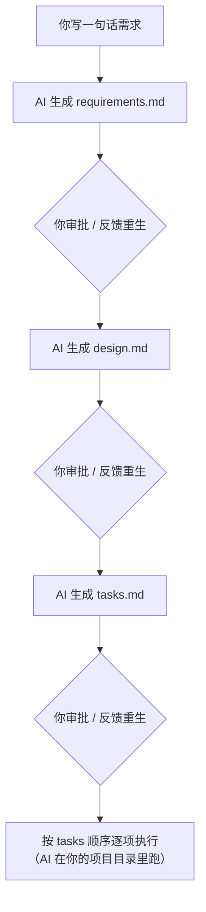

# Sage

A Mac (Electron) app that drives **AI coding** through a **Qoder-style spec workflow**:



底层支持三种后端：**Claude Code CLI**（用本机已安装的 `claude` 命令，复用其登录态，不需要单独 API key）、
**Anthropic API** 直连，以及任意 **OpenAI 兼容 API**（第三方模型 / 自建网关）。可在「设置 → 后端引擎」选择路由策略。

## 先决条件

- macOS 12+
- 已经装好 [Claude Code](https://docs.claude.com/en/docs/claude-code) 并能在终端里跑 `claude`
- Node.js 20+
- npm 10+

## 开发

```bash
cd <项目目录>
npm install
npm run dev
```

`npm run dev` 会同时启动 Vite 渲染层（端口 5173）和 Electron 主进程，热重载。

## 打包成 dmg

```bash
# 可选：先放一张 1024×1024 的 build/icon.png 然后生成 icns
./scripts/make-icon.sh

npm run dist:dmg
```

产物在 `release/` 下。第一次打开 `.app` 因为没有签名，需要在「系统设置 → 隐私与安全性」里允许。

## 目录结构

扩展机制、模块插槽、技能包和浏览器验收示例见 [扩展架构与接入手册](docs/EXTENSIBILITY.md)。
全部文档统一入口：[文档索引](docs/README.md)。逐个业务案例的方案、代码入口和验收见 [场景化二次开发手册](docs/EXTENSION_COOKBOOK.md)。

```
sage/
├── electron/            # 主进程（Node 侧）
│   ├── main.ts          # 入口、窗口、IPC 注册
│   ├── preload.ts       # contextBridge → window.api
│   ├── claude-bridge.ts # spawn claude CLI、解析 stream-json
│   ├── spec-engine.ts   # 三阶段 prompt + tasks.md 解析 + 执行循环
│   ├── store.ts         # 项目列表、spec 元数据持久化
│   └── ipc.ts           # spec:* 通道实现
├── shared/types.ts      # 主/渲染 共用类型
├── src/                 # React 渲染层（Vite）
│   ├── components/      # UI
│   ├── stores/appStore.ts  # zustand 状态
│   ├── styles/index.css
│   ├── App.tsx, main.tsx, index.html, types.d.ts
├── scripts/make-icon.sh
└── package.json         # 含 electron-builder 配置
```

## Spec 数据放在哪

每个项目目录下的 `.sage/specs/<id>/`：

```
<project>/.sage/specs/abcDEF1234/
├── meta.json          # 状态机：phase / 是否批准 / 任务列表
├── requirements.md
├── design.md
└── tasks.md
```

App 内 spec 列表只是这些目录的扫描结果——你完全可以把 `.sage` 提交进 git，团队共享 spec。

## tasks.md 的格式

App 期望 `tasks.md` 含一个 ```yaml 代码块：

```yaml
- id: T1
  title: 实现 X
  files:
    - src/foo.ts
  description: |
    详细描述…
- id: T2
  ...
```

如果 AI 生成的不规整，你可以在 Tasks 标签页里手动编辑保存——保存时 App 会重新解析。

## 权限模式

- **生成 spec 阶段**：固定 `--permission-mode plan`，只读，不会修改你的代码。
- **执行阶段**：默认 `acceptEdits`（自动接受文件编辑，但 bash/网络仍会提示）。可以在「设置」里改成 `default`（每次提示）或 `bypassPermissions`（危险）。

## 已知限制 / 后续

- 没有内置 diff 视图：执行后请用 `git diff` 看实际改动。
- 不支持并发执行多个 task（顺序更稳，方便你随时叫停）。
- 没有 token 计数 / 计费展示。
- 不解析 claude 的 thinking blocks（如启用了 extended thinking）。

## 卸载

App 数据在 `~/Library/Application Support/Sage/`，spec 内容在你的项目下 `.sage/`。
