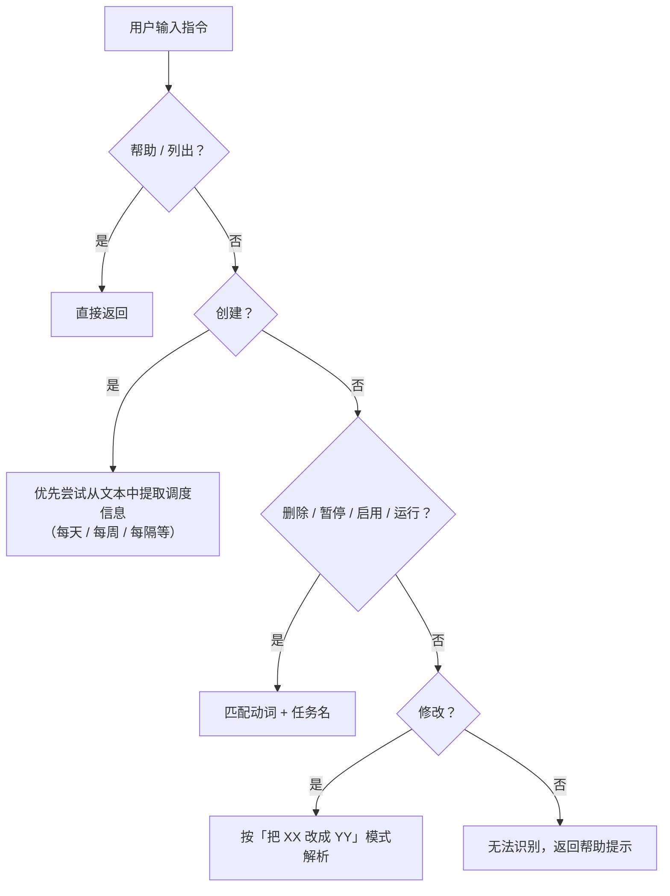
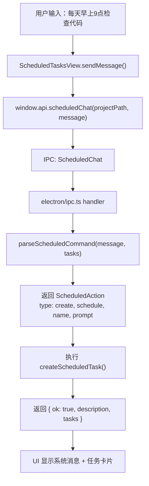

# 定时任务对话式交互改造

## 概述

将定时任务从传统的表单式交互改为完全对话式交互。用户通过自然语言创建、修改、删除、启停定时任务，无需填写任何表单。

## 改动文件

### 1. 新增 NLP 解析器
**文件**: `electron/scheduled-nlp.ts` (新文件)

- 实现自然语言到结构化操作的解析
- 支持中英文指令
- 无需 LLM，本地正则匹配，即时响应

**支持的操作**:
- **创建**: "每天早上9点检查代码质量"
- **修改**: "把review改成下午5点" / "把review的指令改成检查测试覆盖率"
- **删除**: "删掉review任务"
- **暂停/启用**: "暂停review" / "启用review"
- **立即运行**: "立即运行review"
- **列出**: "列出所有任务"
- **帮助**: "帮助"

**解析逻辑**:


**关键设计**:
- 创建命令优先级最高，避免"每天9点运行XX"被误识别为"运行任务"
- 任务名匹配支持模糊匹配（精确匹配 → 包含匹配 → 子序列匹配）
- 时间解析支持中文时段词（早上/下午/晚上）+ 数字（9点/9:30/9点半）

### 2. 类型定义
**文件**: `shared/types.ts`

- 新增 `IpcChannels.ScheduledChat` IPC 通道

### 3. IPC 处理器
**文件**: `electron/ipc.ts`

- 新增 `ScheduledChat` 处理器
- 调用 NLP 解析器解析用户指令
- 执行对应操作（创建/修改/删除等）
- 返回结果和更新后的任务列表

### 4. Preload Bridge
**文件**: `electron/preload.ts`

- 新增 `scheduledChat(projectPath, message)` 方法
- 供渲染进程调用 NLP 解析

### 5. 对话式 UI 组件
**文件**: `src/components/ScheduledTasksView.tsx` (重写)

**界面结构**:
```
┌─────────────────────────────────────────┐
│ 定时任务                          [×]    │
│ 用自然语言管理定时任务                    │
├─────────────────────────────────────────┤
│                                         │
│  [系统] 你好！我是定时任务助手。          │
│  你可以用自然语言创建、修改、删除定时     │
│  任务。试试下面这些指令：                 │
│                                         │
│  [每天早上9点检查代码质量] [每周五...]   │
│                                         │
│  当前定时任务:                           │
│  ┌─ 📋 任务卡片 ──────────────────┐    │
│  │ 🟢 每日代码检查                 │    │
│  │ 🕐 每天 09:00 · 已启用          │    │
│  │ "检查代码质量并生成报告"         │    │
│  │ [▶] [⏸] [🗑]                  │    │
│  │ 运行历史 ▾                      │    │
│  └────────────────────────────────┘    │
│                                         │
│  [用户] 把每日代码检查改成下午5点        │
│                                         │
│  [系统] 已将「每日代码检查」改为         │
│  每天 17:00 执行 ✓                      │
│                                         │
├─────────────────────────────────────────┤
│ [输入指令...]                    [发送]  │
└─────────────────────────────────────────┘
```

**关键特性**:
- 聊天气泡式消息展示（用户消息右侧，系统消息左侧）
- 任务卡片内联显示（包含运行/暂停/删除快捷按钮）
- 可展开的运行历史
- 示例指令按钮（点击后填充到输入框）
- 底部输入框 + 发送按钮

**交互流程**:
1. 用户输入自然语言指令
2. 调用 `window.api.scheduledChat()` → 后端 NLP 解析 → 执行操作
3. 系统返回结果消息 + 更新后的任务列表
4. 任务以卡片形式内联显示在对话中

### 6. 样式
**文件**: `src/styles/index.css`

- 移除旧的表单/列表样式（`.sched-form`, `.sched-list`, `.sched-item` 等）
- 新增对话式样式:
  - `.sched-chat-messages` - 消息容器
  - `.sched-chat-msg` - 单条消息
  - `.sched-chat-msg-avatar` - 头像
  - `.sched-chat-msg-text` - 消息文本气泡
  - `.sched-task-card` - 任务卡片
  - `.sched-task-card-actions` - 卡片操作按钮
  - `.sched-chat-input-area` - 输入区域

### 7. 国际化
**文件**: `src/i18n.ts`

新增翻译 key:
- `scheduled.chat.subtitle` - "用自然语言管理定时任务"
- `scheduled.chat.welcome` - 欢迎语
- `scheduled.chat.existingTasks` - "当前定时任务"
- `scheduled.chat.placeholder` - 输入框占位符

## 技术细节

### NLP 解析器实现

**时间解析** (`parseTime`):
```typescript
// 支持: "9点", "9:30", "9点半", "下午3点", "上午10:30"
// 返回: { hour: 17, minute: 30 }
```

**调度解析** (`parseScheduleFromText`):
```typescript
// "每天9点" → { type: 'daily', at: '09:00' }
// "每周五下午3点" → { type: 'weekly', weekday: 5, at: '15:00' }
// "每隔30分钟" → { type: 'interval', intervalMinutes: 30 }
// "明天上午10点" → { type: 'once', at: 'ISO日期' }
```

**任务名匹配** (`findTaskByPattern`):
```typescript
// 精确匹配 → 包含匹配 → 反向包含 → 子序列匹配
// "review" 可匹配 "代码review" "review任务" "每日review"
```

### IPC 通信流程



## 使用示例

### 创建任务
```
用户: 每天早上9点检查代码质量
系统: 已创建定时任务「检查代码质量」— 每天 09:00
      执行：「检查代码质量」
      [任务卡片]

用户: 每周五下午5点生成周报
系统: 已创建定时任务「生成周报」— 每周五 17:00
      执行：「生成周报」
      [任务卡片]

用户: 每隔30分钟检查服务器状态
系统: 已创建定时任务「检查服务器状态」— 每隔 30 分钟
      执行：「检查服务器状态」
      [任务卡片]
```

### 修改任务
```
用户: 把代码检查改成下午5点
系统: 已将「检查代码质量」的调度改为 每天 17:00
      [任务卡片（已更新）]

用户: 把周报的指令改成生成技术周报
系统: 已将「生成周报」的指令改为「生成技术周报」
```

### 删除任务
```
用户: 删掉代码检查
系统: 已删除「检查代码质量」
```

### 暂停/启用
```
用户: 暂停周报
系统: 已暂停「生成周报」
      [任务卡片（灰色，显示"已停用"）]

用户: 启用周报
系统: 已启用「生成周报」
      [任务卡片（恢复绿色，显示"已启用"）]
```

### 立即运行
```
用户: 立即运行代码检查
系统: 正在运行「检查代码质量」…
```

### 列出任务
```
用户: 列出所有任务
系统: 当前有 3 个定时任务：
      [任务卡片1]
      [任务卡片2]
      [任务卡片3]
```

### 查看运行历史
点击任务卡片上的"运行历史 ▾"按钮，展开最近 5 次运行记录。

## 优势

1. **零学习成本**: 用户无需理解表单字段，直接说话即可
2. **即时反馈**: 本地 NLP 解析，无网络延迟
3. **灵活表达**: 支持多种自然语言表达方式
4. **可视化**: 任务以卡片形式内联显示，一目了然
5. **快捷操作**: 卡片上的按钮可快速运行/暂停/删除
6. **离线可用**: 不依赖 LLM API，完全本地运行

## 后续优化建议

1. **更多时间表达**: 支持"下周一"、"后天"、"月底"等
2. **批量操作**: "暂停所有任务"、"删除已停用的任务"
3. **任务搜索**: "有没有关于review的任务"
4. **任务复制**: "复制代码检查任务，改成每天下午运行"
5. **智能提示**: 输入时显示可能的补全选项
6. **语音输入**: 结合 Electron 的语音 API，支持语音指令
