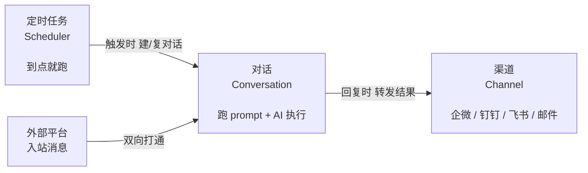
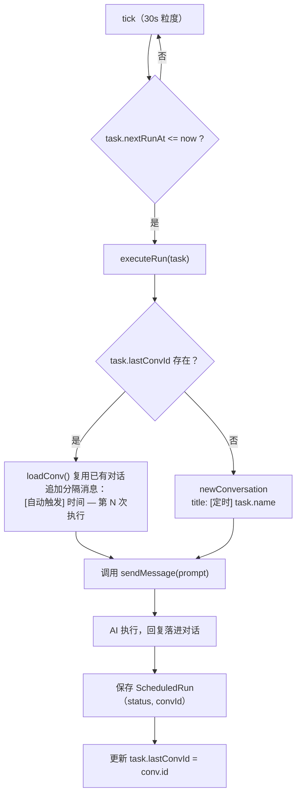
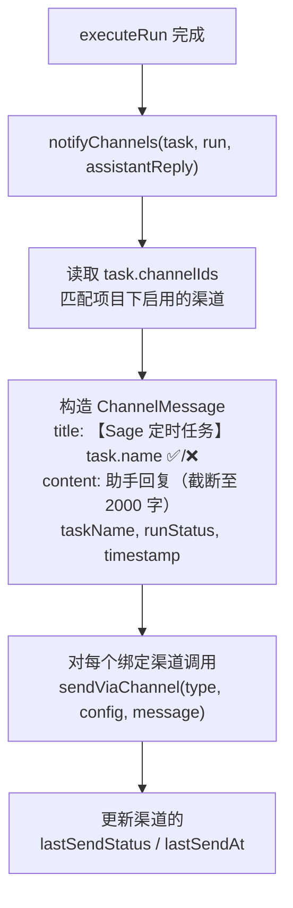
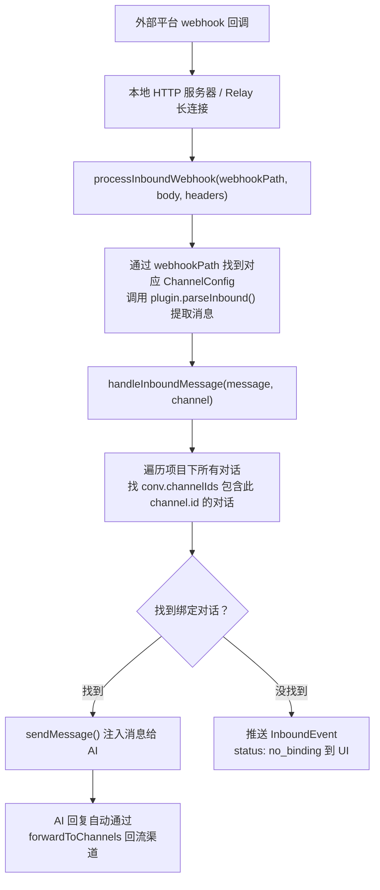
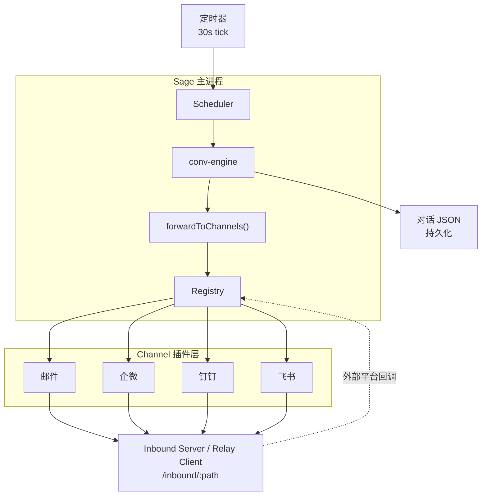

> 历史说明：本文的独立定时任务对话与自然语言解析流程已在 0.6.671 被替代；现行任务机制见 [定时任务](SCHEDULED_TASKS.md)。渠道相关部分保留作参考。

# 定时 · 渠道 · 对话 —— 协作使用手册

## 一句话概览



三者之间的关系：
- **定时** → 驱动 → **对话**（到点自动新建/复用对话执行 prompt）
- **对话** → 推送 → **渠道**（助手回复转发到外部 IM）
- **渠道** → 注入 → **对话**（外部 IM 消息回流给 AI 处理）

---

## 1. 概念说明

### 1.1 定时任务（Scheduled Task）

**是什么**：按 cron 表达式或一次性时间点，自动运行的任务。

**核心字段**：
| 字段 | 说明 |
|---|---|
| `name` | 任务名（用户可读） |
| `prompt` | 给 Claude 执行的指令 |
| `schedule` | 调度配置（一次/每时/每天/每周/每月/间隔） |
| `enabled` | 是否启用 |
| `channelIds` | **关联的渠道列表**（结果推送到哪里） |
| `lastConvId` | **上次执行对应的对话 id**（"查看结果"跳转用） |

**调度类型**（`schedule.type`）：
| 类型 | 关键字段 | 示例 |
|---|---|---|
| `once` | `at: '2025-01-01T10:00:00'` | 一次性 |
| `interval` | `intervalMinutes: 30` | 每 30 分钟 |
| `hourly` | `minute: 0` | 每小时整点 |
| `daily` | `at: '09:00'` | 每天 9 点 |
| `weekly` | `weekday: 1, at: '17:00'` | 每周一 17:00 |
| `monthly` | `monthDay: 15, at: '10:00'` | 每月 15 号 10 点 |

### 1.2 渠道（Channel）

**是什么**：与外部平台（企微/钉钉/飞书/邮件）的双向通信管道。

**内置渠道**（`electron/channels/`）：
| 插件 | 类型标识 | 双向能力 |
|---|---|---|
| `email.ts` | `email` | 仅出站（SMTP 发送邮件） |
| `wechat.ts` | `wechat` | 双向（企微群机器人 webhook + 回调） |
| `dingtalk.ts` | `dingtalk` | 双向（钉钉群机器人） |
| `feishu.ts` | `feishu` | 双向（飞书群机器人） |

**两条数据通路**：
1. **出站**：应用 → 插件 `.send()` → 外部平台（Webhook）
2. **入站**：外部平台 → webhook 回调 → 应用注入对话

**入站接入两种方式**（`inbound-server.ts` + `relay-client.ts`）：
- **本地 HTTP 服务器**（`POST /inbound/:path`）：应用直接暴露端口接收外部回调，需公网可达
- **Relay 长连接**：应用主动外连公网中继服务器透传请求，适合本地无公网 IP

**配置存储**：`<项目>/.sage/channels.json`

### 1.3 对话（Conversation）

**是什么**：与 Claude 的多轮对话，持久化在 `<项目>/.sage/chats/<id>/meta.json`。

**核心字段**：
| 字段 | 说明 |
|---|---|
| `title` | 对话标题 |
| `messages` | 消息列表（user/assistant） |
| `modelProfileId` | 覆盖项目/全局的模型档案 |
| `channelIds` | **关联的渠道列表**（双向打通的关键） |

---

## 2. 三者协作流程

### 2.1 定时 → 对话（执行阶段）



**关键设计**：
- 同一个定时任务的多次执行**复用同一个对话**（不是每次都新建）
- 每次执行通过 `[自动触发]` 分隔消息区分
- 这样方便回溯"这个任务过去 5 次跑的结果"

### 2.2 对话 → 渠道（出站通知）



**同样的链路也适用于普通对话**：
- `ConversationMeta.channelIds` 绑定了渠道的普通对话
- `conv-engine.ts` 在 `sendMessage` 完成后会调用 `forwardToChannels()`
- 把助手的每一段回复都转发到绑定的渠道

### 2.3 渠道 → 对话（入站消息）



**注入的消息格式**：
```text
[来自 <渠道名> 的 <发送者名>]
<原始消息文本>
```

---

## 3. 实操场景

### 场景 A：定时执行 + 企微群通知

**目标**：每天早上 9 点跑"检查代码质量"，结果发到企微群。

**步骤**：
1. **建渠道**：UI 里新增渠道 → 选 `wechat` → 填群机器人 Webhook URL
2. **建定时任务**：`每天早上9点检查代码质量`（NLP 对话式创建）
3. **绑定渠道**：在定时任务卡片里勾选刚才的企微渠道
4. 等待触发 → 自动建对话 → Claude 跑 → 结果发企微

### 场景 B：飞书群 ↔ Claude 对话双向打通

**目标**：飞书群友发消息，Claude 在本地对话里处理并回复到群里。

**步骤**：
1. **建渠道**：新增 `feishu` 渠道 → 填 App ID / App Secret
2. **拿 inbound URL**：UI 里点"复制回调地址"（形如 `http://host:19527/inbound/fs_abc123`）
3. **去飞书开放平台配置回调 URL**
4. **建一个对话**（比如叫"飞书客服"），在对话设置里绑定该飞书渠道
5. 飞书群消息 → 入站 webhook → 注入"飞书客服"对话 → Claude 处理 → 回复转发回飞书群

### 场景 C：邮件通知 + 多项目共享

**目标**：多个项目的定时任务都走同一个 SMTP 邮件渠道。

**步骤**：
1. 在项目 A 建邮件渠道（配 SMTP）
2. 在项目 A 的定时任务绑定该邮件渠道
3. 渠道配置按**项目**隔离——如果跨项目共用，需在每个项目各建一份
4. 或者：未来可通过全局渠道池实现共享（当前未支持）

---

## 4. 数据流总览（一图看懂）



---

## 5. 关键文件速查

| 文件 | 作用 |
|---|---|
| `electron/scheduler.ts` | 调度器核心：tick、executeRun、notifyChannels、handleInboundMessage |
| `electron/scheduled-nlp.ts` | 自然语言解析（对话式创建/管理任务） |
| `electron/conv-engine.ts` | 对话引擎：newConversation、sendMessage、forwardToChannels |
| `electron/channels/registry.ts` | 插件注册表：register / send / test |
| `electron/channels/inbound-server.ts` | 本地入站 HTTP 服务器 + 通用处理逻辑 |
| `electron/channels/relay-client.ts` | Relay 长连接客户端（本地无公网时使用） |
| `electron/channels/{email,wechat,dingtalk,feishu}.ts` | 四个内置插件实现 |
| `electron/channels/types.ts` | ChannelPlugin 接口定义 |
| `shared/types.ts` | ScheduledTask / ConversationMeta / ChannelConfig / InboundMessage |
| `src/components/ScheduledTasksView.tsx` | 定时任务对话式 UI |
| `src/components/ChannelsView.tsx` | 渠道管理 UI |
| `src/components/ChatView.tsx` | 对话 UI（含渠道绑定设置） |

---

## 6. 常见坑 / 注意事项

1. **定时任务不会并发执行同一任务**：`runningTasks` 集合防止同一任务重入，上一次没跑完不会触发下一次。

2. **错过执行（missed）**：调度器 30s 粒度 tick，如果应用关闭时正好该触发，启动后会标记 `missed`，**不会补跑**（避免重复执行造成副作用）。

3. **对话复用策略**：`task.lastConvId` 指向的对话为空或不存在时会自动新建。所以删除对话不会破坏定时任务，但会丢失历史聚合。

4. **入站必须绑定对话**：外部消息进来必须有 `ConversationMeta.channelIds` 包含该渠道，否则报 `no_binding`。

5. **渠道配置按项目隔离**：`<项目>/.sage/channels.json`，跨项目不共享。

6. **通知内容截断**：超过 2000 字自动截断 + `…（内容已截断）` 提示。

7. **入站 URL 必须公网可达**：本地 HTTP 服务器需要端口映射或公网 IP；无公网 IP 建议用 Relay 长连接。

8. **模型消耗**：每次定时执行都走完整的 Claude 调用，注意 token 成本（可给任务对话单独配便宜的 `modelProfileId`）。

9. **入站解析失败不会回错**：`parseInbound()` 返回的 `response` 直接回给外部平台——插件需要按各自平台要求返回正确的 ACK 格式（飞书要 challenge，钉钉要签名验证等）。

10. **对话中注入消息的格式**：入站消息带 `[来自 <渠道名> 的 <发送者>]` 前缀，让 Claude 知道这是外部来的、谁说的。

---

## 7. 扩展新渠道（开发手册）

新增一个渠道只需 3 步：

**1. 实现 `ChannelPlugin` 接口**（参考 `electron/channels/feishu.ts`）：
```typescript
export const myChannel: ChannelPlugin = {
  type: 'mychannel',
  label: '我的渠道',
  fields: [
    { key: 'webhook', label: 'Webhook URL', type: 'url', required: true },
  ],
  validate(config) {
    if (!config.webhook) return '请填写 Webhook URL';
    return null;
  },
  async send(config, message) {
    // 调用外部 API
  },
  async test(config) {
    return this.send(config, { title: '测试', content: 'Hello' });
  },
  parseInbound(body, headers, config) {
    // 解析外部回调 → { text, senderId, isMessage, response }
  },
};
```

**2. 在 `registry.ts` 注册**：
```typescript
import { myChannel } from './mychannel';
registerChannel(myChannel);
```

**3. 完成**：UI 会自动从 `channel:list-types` 拉到新插件，`fields` 自动渲染成表单。

---

## 8. FAQ

**Q: 定时任务每次会新建对话吗？**
A: 不会。同一个任务的所有执行**复用** `task.lastConvId` 指向的同一个对话，用 `[自动触发]` 分隔符区分每次执行。

**Q: 渠道挂了定时任务还能跑吗？**
A: 能。`notifyChannels` 失败只更新 `lastSendStatus`，不抛异常，不影响任务本身的执行。

**Q: 同一个对话能绑定多个渠道吗？**
A: 能。`ConversationMeta.channelIds` 是数组。助手回复会转发到所有绑定渠道。

**Q: 外部消息进来 Claude 回复会自动回到外部吗？**
A: 会。`conv-engine.forwardToChannels()` 在 `sendMessage` 完成后自动把回复转发到该对话绑定的所有渠道。

**Q: 没有绑定对话的入站消息去哪了？**
A: UI 会收到 `InboundEvent(status: 'no_binding')`，可以在 UI 上提示用户"请新建一个对话并绑定该渠道"。

**Q: 能不能让定时任务跑的时候不用默认模型？**
A: 能。新建的定时对话默认继承项目模型档案；可以单独在对话设置里改 `modelProfileId` 用便宜模型。
