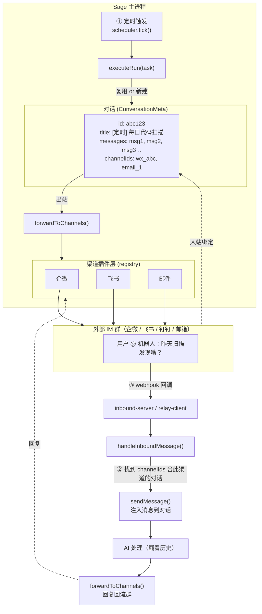
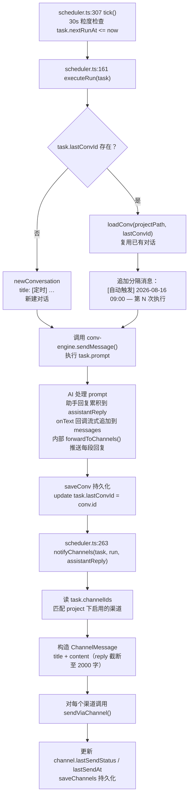
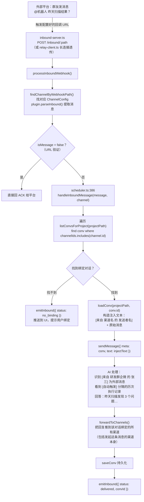
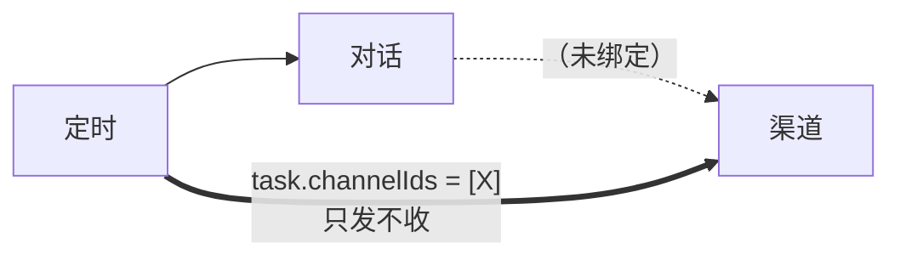
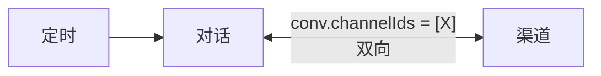
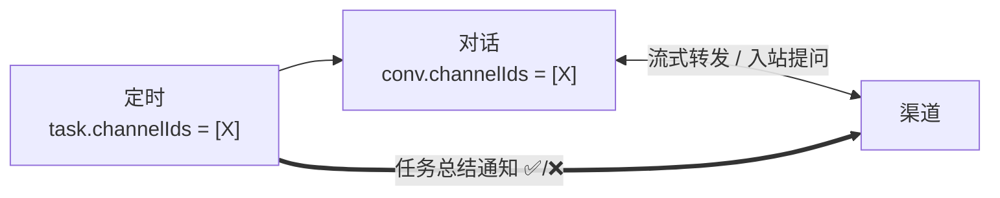

# 深入：定时任务 + 对话 + 渠道 三者打通

## 0. 一图看懂"打通"的含义



**"三者打通"的核心**：三个实体各自独立存在，但通过 **`channelIds`** 这一条纽带连成一个闭环。

---

## 1. 关键数据结构（两个 channelIds 字段）

### 1.1 `ScheduledTask.channelIds`
```typescript
// shared/types.ts:694
export interface ScheduledTask {
  // ...
  channelIds?: string[];
  // ↑ 任务执行完 → 结果通知推送到这些渠道
  // 这是"出站通知"绑定
}
```

### 1.2 `ConversationMeta.channelIds`
```typescript
// shared/types.ts:364
export interface ConversationMeta {
  // ...
  channelIds?: string[];
  // ↑ 双向：
  //   - 助手回复 → 转发到这些渠道（出站）
  //   - 这些渠道的入站消息 → 注入到此对话（入站）
}
```

**关键认知**：
- 定时任务的 channelIds 是**单向出站**（只发不收）
- 对话的 channelIds 是**双向**（既发也收）
- 要把"三者打通"做成闭环，**必须两个都绑**

---

## 2. 完整数据流（代码级走查）

### 2.1 出站：定时 → 对话 → 渠道



**注意**：这里有**两条独立的出站通路**：
1. `conv-engine.forwardToChannels()` —— 对话绑定的渠道，流式转发每一段回复
2. `scheduler.notifyChannels()` —— 任务绑定的渠道，任务结束时统一发一次总结

**为什么有两条？**
- 通路 1 是为了让外部 IM 实时看到 Claude 的思考（适合双向对话场景）
- 通路 2 是为了让外部 IM 收到一条**结构化的任务结果通知**（标题带 ✅/❌，截断过长度）

### 2.2 入站：渠道 → 对话 → Claude → 渠道回流



---

## 3. 实操：怎么配置才能让三者真正打通？

### 场景设定
> 目标：每周一 9 点自动跑代码扫描，结果推到"研发群"企微；
> 群里任何人 @ 机器人问"上次扫出啥"，Claude 能翻历史回答。

### 步骤 1：建渠道（双向）

```
[ChannelsView] → + 新增渠道
   类型：wechat
   名称：研发群企微
   Webhook URL：https://qyapi.weixin.qq.com/cgi-bin/webhook/send?key=xxx
   回调配置（入站）：
      - 选"本地 HTTP 服务器" → 端口 19527
      - 回调 URL = http://<公网IP>:19527/inbound/wx_abc123
   → 系统自动生成 inboundWebhookPath = "wx_abc123"
```

### 步骤 2：在飞书开放平台配回调

把上一步拿到的 URL 填进企微应用的"接收消息回调"。

### 步骤 3：建定时任务

```
你说：每周一早上9点代码扫描

系统：✅ 已创建「代码扫描」
      [卡片]
        🟢 代码扫描
        🕐 每周一 09:00 · 已启用
        "扫描代码并生成报告"
        [绑定渠道] ← 点这里
```

### 步骤 4：给定时任务绑定渠道（出站通知）

在任务卡片里勾选"研发群企微" → `task.channelIds = ["wx_abc123"]`

### 步骤 5：找到任务对应的对话，再绑一次渠道（双向打通）

```
等第一次 9 点触发后：
   ↓ 任务会自动创建一个标题 "[定时] 代码扫描" 的对话
   ↓ 在侧边栏找到这个对话
   ↓ 进入对话设置 → "绑定渠道" → 勾选 "研发群企微"
   ↓ conv.channelIds = ["wx_abc123"]
```

**为什么还要再绑一次？**
- 任务绑定渠道：任务**结束那一刻**发一条总结通知
- 对话绑定渠道：对话里的**每一轮回复**都会转发 + 让对话能接收外部消息

### 步骤 6：验证

```
周一 9:00 → 群收到：
  【Sage 定时任务】代码扫描 ✅
  任务: 代码扫描 ✅
  时间: 2026/8/17 09:00

周三 14:00 群里有人 @："昨天扫出啥？"
  ↓ webhook 进来
  ↓ Sage 找到 channelIds 含 wx_abc123 的对话（就是那个定时对话）
  ↓ Claude 翻看历次执行记录回答
  ↓ 回复回流到群
```

---

## 4. 为什么这样设计？（关键设计决策）

### 决策 1：定时任务复用对话，不是每次新建

**原因**：
- 同一个任务的历次执行结果应该可对比、可追溯
- 群友问"上次结果呢"时，Claude 能在同一个上下文里回答
- 否则每次结果散落在不同对话里，无法累积

**代价**：
- 单条对话会越来越长，token 成本上升
- 解决：可以定期手动归档，或对话超长时清空重建（清空后 lastConvId 失效，自动新建）

### 决策 2：两条独立的出站通路

**原因**：
- 流式转发（对话→渠道）和总结通知（任务→渠道）是两种不同的需求
- 总结通知更正式：带 ✅/❌ 状态、截断过长内容、有结构化标题
- 流式转发更实时：群里能看到 Claude 在想什么

**代价**：
- 如果同一个渠道在任务和对话里都绑了，**会收到两条消息**
- 解决：只选其一，或接受两条（一条实时、一条总结）

### 决策 3：入站必须绑定对话

**原因**：
- 不知道丢给谁 → 直接丢掉，避免消息泄漏
- 推送 `no_binding` 事件到 UI，让用户明确决策

### 决策 4：错过不补跑

**原因**：
- 假设任务有副作用（发邮件、改数据库），补跑会重复
- 标记 missed + 计算下一次 nextRunAt 最安全

---

## 5. 几个真实业务场景

### 场景 A：每日站会助手

```
配置：
- 定时任务：每天 9:30 执行
- Prompt：
  "拉取昨日 git log，总结每位成员的进展；
   识别阻塞点；列出今日建议优先级。"
- 绑定渠道：飞书"工程群"（双向）
- 绑定对话："飞书工程群对话"

流程：
- 每天 9:30 群里自动收到结构化的站会纪要
- 群里任何人问"昨天小明做了啥？"，Claude 翻 log 回答
- 群里说"把小明昨天的改动展开讲讲"，Claude 调用 git show 展开
```

### 场景 B：告警响应 Bot

```
配置：
- 定时任务：每 5 分钟执行
- Prompt：
  "调用 /health 接口，检查关键指标。
   异常就生成一份排查报告并 @ 值班人。"
- 绑定渠道：钉钉"告警群"（仅出站）

流程：
- 正常时：群里收到"✅ 一切正常"
- 异常时：群里收到详细的排查报告 + @ 值班人
- 值班人在群里回复"这个看起来是 X 问题，帮我生成修复 PR"
  → 因为钉钉群是双向的，Claude 真的能去开 PR
```

### 场景 C：周报自动归档

```
配置：
- 定时任务：每周五 17:00 执行
- Prompt："汇总本周所有定时任务执行结果，生成周报"
- 绑定渠道：邮件（给 leader）+ 飞书（给团队群）
- 绑定对话：（不绑）

流程：
- 周五 17:00 跑完后：
  - leader 邮箱收到一份周报
  - 飞书群收到一份周报
- 因为对话没绑渠道，群里没人能反问（纯单向通知）
```

---

## 6. 调试 & 排错

### 6.1 定时任务没触发？
```
检查：
1. task.enabled === true
2. task.nextRunAt <= now
3. task.id 不在 runningTasks 里（上次跑完了吗？）
4. 应用是否在跑？（scheduler 在主进程）
5. 看 UI 是否有 ScheduledEvent 推送
```

### 6.2 渠道没收到通知？
```
检查：
1. task.channelIds 是否包含目标渠道 id
2. channel.enabled === true
3. channel.lastSendStatus 是什么？
   - 'failed' 看 channel.lastSendError
   - 可能是 webhook URL 错 / 网络不通 / 平台拒绝
4. 是任务通知（2000字截断版）还是对话流式转发？
   - 任务通知走 scheduler.notifyChannels()
   - 对话转发走 conv-engine.forwardToChannels()
```

### 6.3 群里 @ 机器人没反应？
```
检查：
1. inbound webhook URL 是否公网可达？
   - 浏览器访问 http://<host>:19527/inbound/wx_abc123
   - 应返回 404/405（没 body），不是超时
2. 外部平台配置回调 URL 时是否正确？
3. 看 UI 是否收到 InboundEvent
   - status: 'no_binding' → 没对话绑这个渠道
   - status: 'delivered' → 已经投递到 Claude，等回复
   - status: 'error' → 看 error 字段
4. Claude 是否真的在跑？看对话 messages 是否增长
5. 回复是否回流？检查 conv.channelIds 是否包含此渠道
```

### 6.4 回复回流到错误的群？
```
检查 conv.channelIds 是否绑了多个渠道：
- 一条助手回复会推到所有绑定的渠道
- 如果定时任务对话同时绑了 A 群和 B 群，两边都会收到
```

### 6.5 怎么手动触发看效果？
```
在定时任务卡片点 ▶ 立即运行
或者对话里说："立即运行 <任务名>"
```

---

## 7. 常见误解澄清

| 误解 | 事实 |
|---|---|
| "定时任务每次都会新建对话" | 错。默认复用 `task.lastConvId` 指向的同一个对话。清空历史后才会新建。 |
| "任务绑了渠道，群里就能问 Claude" | 错。任务 channelIds 是**单向出站**。要让群里能问 Claude，必须给任务对应的**对话**也绑渠道。 |
| "对话绑了渠道，定时结果会通知" | 只对一半。对话绑渠道会让每次 Claude 回复流式转发，但**不会**有"任务完成"那种结构化总结通知。要结构化通知得在**任务**上绑渠道。 |
| "入站消息找不到对话会丢失" | 不会丢，会推送 `no_binding` 事件到 UI 提示用户绑定。 |
| "错过触发会补跑" | 不会。标记 missed，下次按 nextRunAt 触发。 |
| "任务绑了 3 个渠道，Claude 只回一次" | Claude 回复会通过对话绑定的所有渠道**都推一遍**（多播）。 |

---

## 8. 性能 & 成本提醒

1. **Token 累加**：复用的对话会越来越长。每日任务跑 30 天后，对话可能有上万 token。可以定期手动归档或清空。
2. **并发保护**：`runningTasks` 防止同一任务并发，但**不同任务可以并发**。如果多个任务都用 Claude 且都绑了同一个群，群里会收到多条并发消息。
3. **通知截断**：单条通知最多 2000 字。超过会被截断。完整内容只能在对话里看。
4. **入站消息注入格式**：每条外部消息都会带 `[来自 <渠道> 的 <发送者>]` 前缀，这会占 Claude 的输入 token。频繁互动的群建议精简发送者名。

---

## 9. 一图总结三种配置组合

### 配置组合 A：只绑任务渠道（单向通知）

`task.channelIds = [X]`、`conv.channelIds = undefined` → 只发不收，
群里只收得到「任务完成通知」，问 AI 没反应。



### 配置组合 B：只绑对话渠道（双向，但无任务总结）

`task.channelIds = undefined`、`conv.channelIds = [X]` →
群里能实时看到 AI 的流式回复、也能问 AI，
但没有「任务完成 ✅/❌」那种总结通知。



### 配置组合 C：两者都绑（完整打通，推荐）

`task.channelIds = [X]` 且 `conv.channelIds = [X]`：

- 任务结束发一条总结通知（带 ✅/❌）
- AI 回复流式转发（群里能实时看思考过程）
- 群里能问 AI，AI 能翻历史回答

⚠️ **注意**：每条回复群里会收到两次（总结 + 流式），可以二选一。



---

## 10. 关键代码路径速查

| 想改什么 | 文件 | 函数 |
|---|---|---|
| 定时任务触发逻辑 | `electron/scheduler.ts` | `tick()` / `executeRun()` |
| 任务→渠道通知 | `electron/scheduler.ts` | `notifyChannels()` |
| 对话→渠道流式转发 | `electron/conv-engine.ts` | `forwardToChannels()` |
| 入站消息注入对话 | `electron/scheduler.ts` | `handleInboundMessage()` |
| Webhook 路由解析 | `electron/channels/inbound-server.ts` | `processInboundWebhook()` |
| 插件实现 | `electron/channels/{email,wechat,dingtalk,feishu}.ts` | `parseInbound()` / `send()` |
| 渠道配置持久化 | `electron/store.ts` | `listChannels()` / `saveChannels()` |
| UI：任务绑渠道 | `src/components/ScheduledTasksView.tsx` | 任务卡片上的渠道绑定按钮 |
| UI：对话绑渠道 | `src/components/ChatView.tsx` | 对话设置里的渠道选择 |
| UI：入站事件展示 | `src/components/ChannelsView.tsx` | InboundEvent 监听 |
