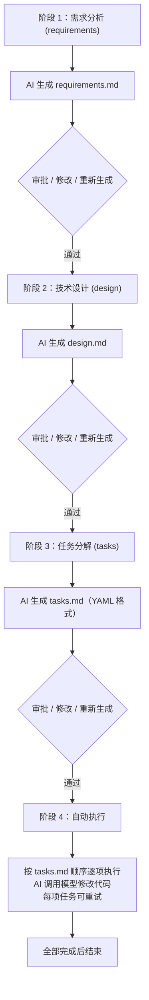
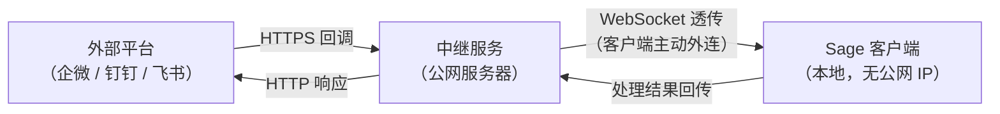
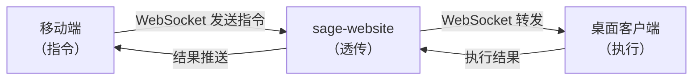

# Sage 完整使用手册

> 历史归档：保留原始记录，不作为当前版本的操作或接口规范。当前入口见 [文档索引](../README.md)。

**版本**：0.1.0  
**更新日期**：2026-08-16

---

## 📋 目录

- [第一部分：客户端（桌面应用）](#第一部分客户端桌面应用)
- [第二部分：服务端（sage-website）](#第二部分服务端sage-website)
- ~~[第三部分：移动端（Sage Mobile）](#第三部分移动端sage-mobile)~~（已弃用）

---

# 第一部分：客户端（桌面应用）

## 1.1 概述

Sage 桌面客户端是核心执行引擎，运行在 macOS 上，将 Claude Code 封装在 Qoder 风格的 Spec 驱动工作流中。

**核心能力**：
- 💬 AI 对话（Claude / GPT）
- 📋 Spec 工作流（需求 → 设计 → 任务 → 执行）
- 📁 项目文件管理
- ⏰ 定时任务调度
- 📢 多渠道通知（企微/钉钉/飞书/邮件/Telegram）
- 🔗 入站消息处理（双向通信）
- 📊 使用统计（项目 + 全局）
- 🖥️ 内置终端

---

## 1.2 安装与启动

### 系统要求
- macOS 12+（Intel / Apple Silicon）
- Claude Code CLI（推荐）或 OpenAI API Key
- Node.js 20+（仅开发时需要）

### 安装步骤

```bash
# 1. 下载 DMG
release/Sage-0.1.0-arm64.dmg

# 2. 双击安装，拖到 Applications 文件夹

# 3. 首次运行需在「系统设置 → 隐私与安全性」中允许
```

### 启动

```bash
# 方式 1：直接打开
open /Applications/Sage.app

# 方式 2：Dock 图标点击
```

---

## 1.3 界面布局

```
┌─────────────────────────────────────────────────────────────┐
│ 侧边栏 (240px)              │ 主区域                        │
├─────────────────────────────┼───────────────────────────────┤
│ 📂 打开项目                  │ ┌───────────────────────────┐│
│                             │ │ 对话标题   [⚙️] [🔔] [📊] ││
│ 📋 对话                      │ ├───────────────────────────┤│
│   + 新建对话                 │ │                           ││
│   ├─ 对话 1                 │ │  消息列表（含工具调用）      ││
│   ├─ 对话 2                 │ │                           ││
│   └─ ...                    │ │  [复制] [下载] [删除]      ││
│                             │ │                           ││
│ 📄 工作流 (Spec)             │ ├───────────────────────────┤│
│   + 新建 Spec               │ │ [模型▼] [🔔] [ctx] [📥]   ││
│   ├─ Spec 1                 │ │ ┌───────────────────────┐ ││
│   └─ ...                    │ │ │ 输入消息...              │ ││
│                             │ │ └───────────────────────┘ ││
│ 📁 项目文件                  │ │        [发送 ▼]          ││
│   ├─ src/                   │ └───────────────────────────┘│
│   ├─ package.json           │                               │
│   └─ ...                    │                               │
├─────────────────────────────┼───────────────────────────────┤
│ ⚙️ 底部菜单                  │ 底部状态栏                    │
│   ├─ ⏰ 定时任务             │ [🔵 sage] [中继已连接] [📊]   │
│   ├─ 📢 通知渠道             │                               │
│   ├─ 🖥️ 终端                │                               │
│   ├─ 📊 使用统计             │                               │
│   ├─ ⚙ 设置                │                               │
│   └─ ℹ️ 关于               │                               │
└─────────────────────────────┴───────────────────────────────┘
```

---

## 1.4 核心功能详解

### 1.4.1 对话管理

#### 新建对话
- 点击侧边栏「+ 新建对话」
- 快捷键：`Cmd + N`
- 系统自动分配 ID（如 `-5xqzG60`）

#### 重命名对话
- 双击对话标题
- 输入新名称
- 按 Enter 确认，Esc 取消

#### 删除对话
- 右键对话 → 删除
- 或使用对话内的「删除」按钮
- **注意**：删除后无法恢复，但统计数据会保留

#### 切换对话
- 点击侧边栏对话项
- 或使用快捷键 `Cmd + 1/2/3...`（前 9 个）

#### 导出对话
- 点击对话标题栏的 📥 按钮
- 保存为 PNG 图片（含完整消息 + 工具调用）

#### 多窗口支持
- 同一项目不允许多开（自动聚焦已有窗口）
- 不同项目可以开新窗口
- 菜单「文件 → 新建窗口」

---

### 1.4.2 消息操作

#### 发送消息
- 输入框输入内容
- `Enter` 发送
- `Shift + Enter` 换行
- 支持图片附件（拖拽或粘贴）

#### 消息排队
当 AI 正在回复时，可继续输入：
```
┌─────────────────────────────────────┐
│ ☰ 消息 1                      [×]   │  ← 拖拽排序
│ ☰ 消息 2                      [×]   │
│ ☰ 消息 3                      [×]   │
└─────────────────────────────────────┘
提示：AI 完成后自动执行队列中的消息
```

#### 智能发送按钮
- **单击**：发送消息
- **长按 500ms**：停止 AI
- **队列中有消息**：图标变为 🕐（时钟）

#### 消息操作（悬停显示）
- **复制**：点击复制图标
- **删除**：点击删除图标
- **保存为图片**：点击下载图标
- **查看时间**：消息右下角时间戳

#### 重试消息
- 悬停 AI 回复 → 点击「重试」
- 系统会重新请求并替换当前回复

---

### 1.4.3 Spec 工作流

Spec 是 Qoder 风格的四阶段工作流：



#### 创建 Spec
1. 点击侧边栏「+ 新建 Spec」
2. 输入标题（如「实现用户登录」）
3. 输入描述（如「支持手机号+验证码登录」）
4. 点击创建

#### 生成阶段文档
1. 选中 Spec
2. 点击「生成需求」/「生成设计」/「生成任务」
3. 等待 AI 生成（30s - 2min）
4. 查看生成的文档
5. 点击「审批」或「修改」

#### 执行任务
1. 确保 requirements / design / tasks 都已审批
2. 点击「执行」
3. 系统按 tasks.md 顺序逐项执行
4. 可在「执行日志」面板查看进度
5. 每项任务完成后自动进入下一项

#### 任务管理
- **重试**：失败的任务可点击「重试」
- **跳过**：不重要的任务可点击「跳过」
- **中止**：点击「中止」停止执行

---

### 1.4.4 文件管理

#### 项目文件树
- 侧边栏「📁 项目文件」
- 显示项目目录下所有文件
- 支持展开/折叠文件夹
- 点击文件打开编辑

#### 文件编辑
- 支持文本文件编辑（代码、Markdown、JSON 等）
- Markdown 文件支持「预览/源码」切换
- 图片文件支持预览（点击放大）
- 编辑后自动标记「未保存」
- 按 `Cmd + S` 保存

#### 文件搜索
- 顶部搜索框输入关键词
- 实时过滤文件列表
- 支持文件名和内容搜索

---

### 1.4.5 定时任务

#### 创建任务
1. 点击底部菜单「⏰ 定时任务」
2. 点击「+ 新建任务」
3. 填写：
   - **名称**：如「每日代码审查」
   - **执行时间**：
     - 一次性：指定日期时间
     - 周期性：cron 表达式（如 `0 9 * * *` 每天 9 点）
   - **任务内容**：
     - 选择现有对话
     - 或新建对话（填写 prompt）
   - **通知渠道**：选择通知方式
4. 点击「创建」

#### 任务管理
- **启用/禁用**：点击开关
- **立即执行**：点击「执行」按钮
- **编辑**：点击任务项
- **删除**：右键 → 删除
- **查看历史**：点击任务 → 「执行记录」

#### 执行记录
- 每次执行生成一条记录
- 包含：开始时间、结束时间、状态、日志
- 失败的任务可查看错误详情
- 可重新执行

#### Cron 表达式示例
```
0 9 * * *          # 每天 9:00
0 9 * * 1-5        # 工作日 9:00
0 */2 * * *        # 每 2 小时
0 9 1 * *          # 每月 1 号 9:00
```

---

### 1.4.6 通知渠道

#### 支持的渠道类型

| 类型 | 方向 | 说明 |
|------|------|------|
| 邮件 | 单向 | SMTP 发送邮件 |
| 企业微信 | 双向 | Webhook + 事件订阅 |
| 钉钉 | 双向 | Webhook + 事件订阅 |
| 飞书群机器人 | 单向 | 自定义 Webhook（只发） |
| 飞书应用机器人 | 双向 | 开放 API + 事件订阅 |
| Telegram | 双向 | Bot API + Webhook |

#### 配置渠道

**邮件**
```
收件人：user@example.com
SMTP 服务器：smtp.gmail.com
端口：587
用户名：your-email@gmail.com
密码：应用专用密码
发件人：your-email@gmail.com
```

**企业微信**
```
Webhook URL：https://qyapi.weixin.qq.com/cgi-bin/webhook/send?key=xxx
@手机号：13800138000,13900139000（可选）
消息格式：text / markdown
```

**钉钉**
```
Webhook URL：https://oapi.dingtalk.com/robot/send?access_token=xxx
密钥（可选）：SECxxx
@手机号：13800138000
```

**飞书群机器人（单向）**
```
Webhook URL：https://open.feishu.cn/open-apis/bot/v2/hook/xxx
签名密钥（可选）：xxx
消息格式：text / markdown
```

**飞书应用机器人（双向）**
```
App ID：cli_xxxxxxxxx
App Secret：xxxxxxxxxxxxxxxx
接收者 ID 类型：chat_id / open_id / user_id
接收者 ID：oc_xxxxxxxx
Encrypt Key（可选）：xxx
Verification Token（可选）：xxx
```

**Telegram**
```
Bot Token：123456:ABC-DEF1234ghIkl-zyx57W2v1u123ew11
Chat ID：-1001234567890
消息格式：Markdown / HTML
```

#### 测试渠道
- 配置完成后点击「测试」
- 发送测试消息
- 检查是否收到

#### 渠道状态
- ✅ 绿色：最近一次发送成功
- ❌ 红色：最近一次发送失败
- ⚠️ 黄色：发送中或未知状态

#### 入站 URL（双向渠道）
双向渠道会显示入站 URL：
```
完整 URL：https://relay.example.com/whk_xxx/wechat_abc123
路径：/wechat_abc123
```

配置到外部平台的回调地址即可接收消息。

---

### 1.4.7 入站中继（Relay）

#### 什么是中继？
客户端运行在本地，没有公网 IP。外部平台（企微/钉钉/飞书）的回调需要公网可达的 HTTPS URL。中继服务部署在公网服务器上，客户端主动连接中继，中继把收到的 webhook 请求透传给客户端。



#### 配置中继
1. 打开「设置 → 入站中继」
2. 填写：
   - **中继 URL**：如 `wss://relay.example.com/ws`
   - **Client Token**：如 `sgr_xxxxxxxxxxxxxxxx`
   - **启用中继**：勾选
3. 保存

#### 中继状态指示器
底部状态栏显示中继连接状态：
- 🟢 中继已连接：正常工作
- 🟡 中继连接中：正在连接
- 🔴 中继异常：连接失败
- ⚪ 中继未连接：未启用

#### 悬停详情
悬停中继状态显示完整 URL 和错误信息：
```
入站中继：已连接 (wss://relay.example.com/ws)
```

---

### 1.4.8 使用统计

#### 项目维度
当前项目的对话统计：
- 输入 tokens
- 输出 tokens
- 缓存读取 tokens
- 缓存写入 tokens
- 估算费用（USD）

#### 全局维度
所有项目的汇总统计：
- 所有项目的 tokens 总量
- 所有项目的费用总量

#### 时间粒度
每个维度下有 5 个时间粒度的趋势图：
- **分钟**：最近 60 分钟
- **小时**：最近 48 小时
- **日**：最近 30 天
- **月**：最近 12 个月
- **年**：全部年份

#### 查看方式
1. 点击底部状态栏的「📊 统计」
2. 切换「项目维度」/「全局维度」Tab
3. 查看各时间粒度的趋势图

---

### 1.4.9 内置终端

#### 打开终端
- 点击底部菜单「🖥️ 终端」
- 快捷键：`Cmd + T`

#### 终端操作
- **新建终端**：点击「+」
- **切换终端**：点击终端标签
- **关闭终端**：点击 × 或 `Cmd + W`
- **全屏**：双击标题栏

#### 终端功能
- 支持完整的 shell（bash/zsh）
- 支持颜色、复制粘贴
- 支持滚动、搜索
- 工作目录默认为项目根目录

---

### 1.4.10 设置

#### 通用设置
- **主题**：浅色 / 深色 / 系统
- **语言**：中文 / English
- **默认权限模式**：
  - `default`：每次提示
  - `acceptEdits`：自动接受文件编辑
  - `bypassPermissions`：跳过所有权限检查（危险）

#### AI 后端设置
- **Claude Code CLI 路径**：可选，默认自动检测
- **API 协议**：Anthropic / OpenAI
- **API Key**：Anthropic API Key 或 OpenAI API Key
- **Base URL**：自定义 API 端点（用于兼容服务）
- **模型**：选择模型（如 claude-3-5-sonnet-20241022）

#### 入站中继设置
- **中继 URL**：WebSocket 连接地址
- **Client Token**：认证令牌
- **启用中继**：是否启用

#### 项目设置（每个项目独立）
- **项目路径**：只读
- **项目模型**：覆盖全局模型设置
- **删除项目**：从列表移除（不删除数据）

---

### 1.4.11 快捷键

| 快捷键 | 功能 |
|--------|------|
| `Cmd + N` | 新建对话 |
| `Cmd + T` | 打开终端 |
| `Cmd + W` | 关闭当前标签 |
| `Cmd + 1/2/3...` | 切换对话（前 9 个） |
| `Cmd + S` | 保存文件 |
| `Cmd + ,` | 打开设置 |
| `Cmd + Q` | 退出应用 |
| `Cmd + F` | 文件搜索 |
| `Cmd + Shift + F` | 全局搜索 |

---

### 1.4.12 数据存储位置

#### 应用数据
```
~/Library/Application Support/Sage/
├── settings.json          # 全局设置
├── global-stats.json      # 全局统计
└── projects.json          # 项目列表
```

#### 项目数据
```
<project>/.sage/
├── conversations/         # 对话数据
│   ├── <id>/meta.json
│   └── ...
├── specs/                 # Spec 数据
│   ├── <id>/
│   │   ├── meta.json
│   │   ├── requirements.md
│   │   ├── design.md
│   │   └── tasks.md
│   └── ...
├── channels/              # 渠道配置
│   └── channels.json
├── scheduled/             # 定时任务
│   ├── tasks.json
│   └── runs/
├── steering/              # 引导文档
│   ├── product.md
│   ├── tech.md
│   └── structure.md
├── skills/                # Skills
│   └── *.md
└── stats.json             # 项目统计
```

#### 卸载
```bash
# 删除应用
rm -rf /Applications/Sage.app

# 删除应用数据
rm -rf ~/Library/Application\ Support/Sage/

# 删除项目数据（保留项目本身）
rm -rf <project>/.sage/
```

---

# 第二部分：服务端（sage-website）

## 2.1 概述

sage-website 是 Sage 的公网中继服务器，部署在有公网 IP 的 Linux 服务器上，用于透传外部平台（企微/钉钉/飞书）的 webhook 请求到本地客户端。

**核心能力**：
- 🔄 WebSocket 长连接透传
- 🔐 双 Token 安全隔离
- 📊 管控后台（Token 管理 + 日志 + 统计）
- 📥 下载服务（安装包分发）
- 📝 分级日志聚合（分钟/小时/天/年）

---

## 2.2 安装部署

### 系统要求
- Linux 服务器（推荐 Ubuntu 20.04+）
- 公网 IP
- 域名（用于 HTTPS 证书）
- Node.js 18+

### 方式一：一键安装（推荐）

```bash
# 1. 上传到服务器
scp -r tools/sage-website root@服务器IP:/root/

# 2. SSH 登录并安装
ssh root@服务器IP
cd /root/sage-website
sudo ADMIN_TOKEN=你的管理密码 bash install.sh relay.example.com
```

脚本自动完成：
- 安装 Node.js
- 部署到 `/opt/sage-website`
- 创建 systemd 服务
- 配置 Caddy HTTPS

### 方式二：手动安装

```bash
# 1. 安装 Node.js
curl -fsSL https://deb.nodesource.com/setup_20.x | sudo -E bash -
sudo apt-get install -y nodejs

# 2. 安装依赖
cd tools/sage-website
npm install

# 3. 启动服务
PORT=8080 ADMIN_TOKEN=你的管理密码 node server.js
```

### 方式三：Docker

```bash
# 构建镜像
docker build -t sage-website .

# 运行容器
docker run -d --restart always \
  -p 8080:8080 \
  -e ADMIN_TOKEN=你的管理密码 \
  -v sage-website-data:/app/data \
  sage-website
```

### 环境变量

| 变量 | 默认值 | 说明 |
|------|--------|------|
| `PORT` | `8080` | 监听端口 |
| `ADMIN_TOKEN` | 自动生成 | 管控后台主管理员 Token |
| `WEBHOOK_TIMEOUT` | `15000` | Webhook 透传超时（ms） |
| `LOG_RAW_DAYS` | `1` | 原始明细保留天数 |
| `LOG_DEBUG_MAX` | `500` | 调试文件数量上限 |
| `DATA_DIR` | `./data` | 数据持久化目录 |

---

## 2.3 双 Token 安全模型

每个客户端持有两种 Token，职责分离：

| Token 类型 | 前缀 | 用途 | 暴露面 |
|-----------|------|------|--------|
| **Client Token** | `sgr_` | WebSocket 连接 + 登录后台 | 只存客户端本地 |
| **Webhook Token** | `whk_` | 对外配置给渠道的回调 URL | 出现在外部平台配置中 |

**安全收益**：
- Webhook Token 泄露只能投递回调，无法建立 WS 连接
- Client Token 泄露只能连接，无法接收回调
- 怀疑泄露时可单独重置

---

## 2.4 管控后台

访问 `https://relay.example.com/admin`

### 登录方式

**Master Admin Token（`adm_`）**
- 颁发/删除所有客户端
- 重置所有 Token
- 查看全局统计
- 查看所有日志

**Client Token（`sgr_`）**
- 只能查看和管理自己
- 改名、调试开关、启停
- 查看自己的日志

### Token 管理

**颁发 Token**
1. 点击「颁发新 Token」
2. 填写客户端名称（如「开发机 1」）
3. 系统自动生成一对 Token：
   - Client Token：`sgr_xxxxxxxxxxxxxxxx`
   - Webhook Token：`whk_yyyyyyyyyyyyyyyy`
4. 复制给客户端

**启用/停用**
- 点击 Token 旁的开关
- 停用后：
  - WebSocket 连接被踢
  - Webhook 返回 403

**重置 Token**
- **重置 Client Token**：仅 Admin 可操作，连接凭证立即失效
- **重置 Webhook Token**：Admin 或本人可操作，对外回调地址立即失效

**删除**
- 点击「删除」
- 确认删除
- 断开连接并移除（日志保留）

### 访问日志

每个 Token 卡片点击「访问日志」查看：
- 时间
- 方法（GET/POST）
- 路径
- 状态码
- 耗时

日志按 Token 隔离存放：
```
data/logs/<tokenId>/day-YYYY-MM-DD.json
```

### 汇总统计

点击「汇总统计」查看：
- 总请求数
- 5 分钟/1 小时/24 小时请求数
- 状态分布（2xx/3xx/4xx/5xx）
- 24 小时逐小时图表

### 调试模式

**开启调试**
1. 点击 Token 卡片
2. 开启「调试模式」
3. 每次请求单独存放完整文件：
   ```
   data/logs/<tokenId>/debug/
   ├── req-20260816-210000-abc123.json
   ├── resp-20260816-210000-abc123.json
   └── ...
   ```

**查看调试文件**
- 点击「调试文件」
- 查看请求/响应详情

**关闭调试**
- 调试完记得关闭，避免占用磁盘

---

## 2.5 下载服务

访问 `https://relay.example.com/download`

### 使用方式
1. 使用管控后台的 Token 登录
2. 展示文件列表
3. 点击文件名下载

### 上传文件
```bash
# 将文件放到 data/download/ 目录
scp release/Sage-0.1.0-arm64.dmg root@服务器IP:/opt/sage-website/data/download/
```

### 下载机制
- 前端通过 Bearer Token 认证下载
- Token 不出现在 URL 中
- 显示下载进度条

---

## 2.6 运维管理

### 服务管理

```bash
# 查看状态
sudo systemctl status sage-website

# 启动
sudo systemctl start sage-website

# 停止
sudo systemctl stop sage-website

# 重启
sudo systemctl restart sage-website

# 查看日志
sudo journalctl -u sage-website -f
```

### 数据备份

```bash
# 备份数据目录
sudo tar -czf sage-website-backup-$(date +%Y%m%d).tar.gz \
  /opt/sage-website/data/

# 恢复
sudo tar -xzf sage-website-backup-YYYYMMDD.tar.gz -C /opt/sage-website/
sudo systemctl restart sage-website
```

### 日志清理

```bash
# 清理超过 30 天的原始日志
sudo find /opt/sage-website/data/logs -name "day-*.json" -mtime +30 -delete

# 清理调试文件
sudo rm -rf /opt/sage-website/data/logs/*/debug/*
```

### 监控

**健康检查**
```bash
curl https://relay.example.com/health
# 返回：{"status":"ok","uptime":86400}
```

**查看在线客户端**
```bash
curl -H "Authorization: Bearer adm_xxx" \
  https://relay.example.com/admin/api/stats
# 返回：{"onlineClients":2,"totalTokens":5,...}
```

---

## 2.7 故障排查

### 问题 1：客户端连接失败

**症状**：底部状态栏显示「中继异常」

**排查步骤**：
1. 检查中继 URL 是否正确
2. 检查 Client Token 是否正确
3. 检查网络连通性：
   ```bash
   curl -I https://relay.example.com/health
   ```
4. 查看客户端日志：
   ```
   ~/Library/Logs/Sage/main.log
   ```

### 问题 2：Webhook 收不到

**症状**：外部平台配置了回调，但收不到消息

**排查步骤**：
1. 检查 Webhook Token 是否正确
2. 检查渠道是否启用
3. 查看管控后台访问日志
4. 检查客户端是否在线

### 问题 3：服务崩溃

**症状**：服务频繁重启

**排查步骤**：
1. 查看日志：
   ```bash
   sudo journalctl -u sage-website -n 100
   ```
2. 检查内存使用：
   ```bash
   sudo systemctl status sage-website
   ```
3. 检查磁盘空间：
   ```bash
   df -h
   ```
4. 重启服务：
   ```bash
   sudo systemctl restart sage-website
   ```

---

# 第三部分：移动端（Sage Mobile）

## 3.1 概述

Sage Mobile 是远程控制应用，运行在 iOS / Android 上，通过 sage-website 与桌面客户端通信。

**定位**：遥控器 + 显示器  
**核心能力**：
- 💬 查看和管理对话
- 📋 查看 Spec 工作流
- ⏰ 查看和管理定时任务
- 📊 查看使用统计
- 🔔 接收通知

**注意**：移动端是**只读 + 指令下发**，所有 AI 推理、代码执行都在桌面客户端完成。

---

## 3.2 安装

### 开发环境

```bash
cd tools/sage-mobile
npm install
```

### 运行

```bash
# iOS 模拟器
npm run ios

# Android 模拟器
npm run android

# 真机（需要 Expo Go 应用）
npm start
```

### 构建

```bash
# iOS
npm run build:ios

# Android APK
npm run build:android
```

---

## 3.3 界面布局

### 登录页

```
┌─────────────────────────────┐
│                             │
│      🧙 Sage Mobile         │
│                             │
│  中继 URL                    │
│  ┌─────────────────────┐   │
│  │ wss://relay...       │   │
│  └─────────────────────┘   │
│                             │
│  Client Token              │
│  ┌─────────────────────┐   │
│  │ sgr_xxxxxxxxxxxxxxxx │   │
│  └─────────────────────┘   │
│                             │
│      [ 登 录 ]              │
│                             │
└─────────────────────────────┘
```

### 主界面（底部导航）

```
┌─────────────────────────────┐
│ 对话                        │  ← 顶部标题
├─────────────────────────────┤
│                             │
│  ┌─────────────────────┐   │
│  │ 项目 A               │   │
│  │ 对话 1              │   │
│  │ 对话 2              │   │
│  └─────────────────────┘   │
│                             │
│  ┌─────────────────────┐   │
│  │ 项目 B               │   │
│  │ 对话 3              │   │
│  └─────────────────────┘   │
│                             │
├─────────────────────────────┤
│  📋     💬     ⏰     📊   │  ← 底部导航
│ Spec   对话   任务   统计  │
└─────────────────────────────┘
```

---

## 3.4 功能详解

### 3.4.1 对话列表

- 显示所有项目的对话
- 按项目分组
- 点击对话查看详情

### 3.4.2 对话详情

- 查看完整消息历史
- 查看工具调用详情
- 发送新消息
- 停止当前回复

### 3.4.3 Spec 列表

- 显示所有 Spec
- 查看 Spec 状态（需求/设计/任务/执行中/完成）
- 点击进入 Spec 详情

### 3.4.4 Spec 详情

- 查看三阶段文档（requirements / design / tasks）
- 审批/修改文档
- 触发执行
- 查看执行日志

### 3.4.5 定时任务

- 查看所有定时任务
- 启用/禁用任务
- 立即执行
- 查看执行历史

### 3.4.6 使用统计

- 查看全局统计（所有项目）
- 查看项目维度统计
- 查看时间趋势图

---

## 3.5 与桌面客户端的关系

### 通信机制



### 指令类型

**查询指令**
- 获取项目列表
- 获取对话列表
- 获取对话详情
- 获取 Spec 列表
- 获取 Spec 详情
- 获取定时任务列表
- 获取使用统计

**操作指令**
- 发送消息
- 停止回复
- 审批文档
- 执行 Spec
- 启用/禁用任务
- 立即执行任务

### 设计原则

1. **客户端自治**：移动端断网不影响桌面客户端执行已触发任务
2. **只读缓存**：移动端本地缓存仅用于离线显示，不双向同步
3. **指令幂等**：所有指令都带 requestId，客户端保证幂等执行
4. **视觉一致**：与桌面端信息密度一致，但采用 Material Design 3 风格

---

## 3.6 数据同步

### 同步策略

**实时同步**
- 对话消息：WebSocket 实时推送
- Spec 状态变更：WebSocket 实时推送
- 任务执行状态：WebSocket 实时推送

**按需同步**
- 项目列表：打开 App 时拉取
- 使用统计：切换 Tab 时拉取

**离线缓存**
- 最近查看的对话
- 最近查看的 Spec
- 定时任务列表

### 缓存清理

```
设置 → 清除缓存
```

清理后下次打开会重新拉取所有数据。

---

## 3.7 通知推送

### 启用通知

1. 打开 App
2. 首次启动会请求通知权限
3. 允许通知

### 通知类型

**对话完成通知**
- AI 回复完成时推送
- 点击通知跳转到对话详情

**任务完成通知**
- 定时任务执行完成时推送
- 点击通知跳转到任务详情

**错误通知**
- 任务执行失败时推送
- 点击通知查看错误详情

### 关闭通知

```
设置 → 通知 → 关闭
```

或在系统设置中关闭 Sage 通知。

---

## 3.8 安全存储

### Token 存储

Client Token 使用安全存储：
- **iOS**：Keychain
- **Android**：EncryptedSharedPreferences

### 清除 Token

```
设置 → 退出登录
```

退出后 Token 从安全存储中删除。

---

## 3.9 故障排查

### 问题 1：无法连接

**症状**：登录页显示「连接失败」

**排查步骤**：
1. 检查中继 URL 是否正确
2. 检查 Client Token 是否正确
3. 检查网络连通性
4. 查看桌面客户端中继状态

### 问题 2：消息不同步

**症状**：移动端看不到桌面客户端的消息

**排查步骤**：
1. 检查 WebSocket 连接状态
2. 刷新页面
3. 清除缓存
4. 重新登录

### 问题 3：通知收不到

**症状**：任务完成了但没收到通知

**排查步骤**：
1. 检查通知权限
2. 检查系统通知设置
3. 检查 App 内通知设置
4. 重启 App

---

## 3.10 开发指南

### 技术栈

- React Native 0.76+
- Expo SDK 52
- TypeScript 5+
- Zustand（状态管理）
- React Navigation（路由）
- React Native Paper（UI 组件）
- reconnecting-websocket（WebSocket）
- expo-secure-store（安全存储）
- expo-notifications（推送通知）

### 项目结构

```
tools/sage-mobile/
├── app/
│   ├── src/
│   │   ├── api/
│   │   │   ├── relay.ts         # Relay API 客户端
│   │   │   └── types.ts         # API 类型定义
│   │   ├── screens/             # 页面
│   │   │   ├── LoginScreen.tsx
│   │   │   ├── ConversationListScreen.tsx
│   │   │   ├── ConversationDetailScreen.tsx
│   │   │   ├── TaskListScreen.tsx
│   │   │   └── MonitoringScreen.tsx
│   │   ├── components/          # 复用组件
│   │   │   ├── MessageBubble.tsx
│   │   │   ├── TaskCard.tsx
│   │   │   └── StatusIndicator.tsx
│   │   ├── stores/              # Zustand stores
│   │   │   ├── authStore.ts
│   │   │   ├── conversationStore.ts
│   │   │   ├── projectStore.ts
│   │   │   └── taskStore.ts
│   │   └── utils/               # 工具函数
│   │       ├── storage.ts
│   │       └── notifications.ts
│   ├── app.json                 # Expo 配置
│   └── package.json
└── README.md
```

### 添加新功能

1. **定义 API 类型**
   ```typescript
   // api/types.ts
   export interface NewFeature {
     id: string;
     name: string;
   }
   ```

2. **实现 API 方法**
   ```typescript
   // api/relay.ts
   async getNewFeature(): Promise<NewFeature> {
     const response = await this.httpClient.get('/api/new-feature');
     return response.data;
   }
   ```

3. **创建 Store**
   ```typescript
   // stores/newFeatureStore.ts
   export const useNewFeatureStore = create((set) => ({
     data: null,
     fetch: async () => {
       const data = await relayApi.getNewFeature();
       set({ data });
     },
   }));
   ```

4. **创建页面**
   ```typescript
   // screens/NewFeatureScreen.tsx
   export function NewFeatureScreen() {
     const { data, fetch } = useNewFeatureStore();
     useEffect(() => { fetch(); }, []);
     return <View>...</View>;
   }
   ```

5. **注册路由**
   ```typescript
   // app/_layout.tsx
   <Stack.Screen name="new-feature" />
   ```

---

## 3.11 发布流程

### iOS

```bash
# 1. 构建
npm run build:ios

# 2. 上传到 TestFlight
xcrun altool --upload-app -f build/ios/Sage.ipa ...

# 3. 测试通过后发布到 App Store
```

### Android

```bash
# 1. 构建
npm run build:android

# 2. 上传到 Google Play Console
# 使用 Google Play 开发者控制台上传 APK/AAB

# 3. 测试通过后发布
```

---

# 附录

## A. 常见问题

### Q1: 如何选择 AI 后端？

**推荐**：
- **Claude Code CLI**：功能最全，支持工具调用、文件编辑
- **Anthropic API**：适合没有 CLI 的环境
- **OpenAI API**：适合已有 OpenAI Key 的用户

### Q2: 对话数据会丢失吗？

不会。对话数据保存在项目目录的 `.sage/chats/` 下，即使删除应用，数据依然存在。

旧版 `.sage/conversations/` 会在首次读取或写入对话时自动迁移到 `chats/`，包括对话记忆。两目录同时存在时合并缺失文件；同名冲突保留 `chats/` 中的文件，并将旧文件备份到 `chats/.legacy-conversations/`，不会覆盖。

### Q3: 如何备份数据？

```bash
# 备份应用数据
tar -czf sage-app-backup.tar.gz ~/Library/Application\ Support/Sage/

# 备份项目数据
tar -czf sage-project-backup.tar.gz <project>/.sage/
```

### Q4: 支持多语言吗？

支持中文和英文。在「设置 → 语言」中切换。

### Q5: 如何反馈问题？

- GitHub Issues：https://github.com/your-org/sage/issues
- 邮件：support@example.com

---

## B. 术语表

| 术语 | 说明 |
|------|------|
| Spec | Qoder 风格的四阶段工作流（需求→设计→任务→执行） |
| Token | 认证凭证（Client Token / Webhook Token） |
| Relay | 公网中继服务器 |
| Inbound | 入站消息（从外部平台到桌面客户端） |
| Outbound | 出站消息（从桌面客户端到外部平台） |
| Webhook | HTTP 回调机制 |
| WebSocket | 全双工通信协议 |
| Cron | 定时任务表达式 |

---

## C. 更新日志

### v0.1.0 (2026-08-16)

**新功能**
- 飞书渠道拆分为 webhook（单向）和 app（双向）
- 新增 Telegram 渠道支持
- 使用统计支持项目维度和全局维度
- 底部状态栏新增中继状态指示器
- 同一项目不允许多开窗口

**修复**
- 修复对话文件在写入过程中损坏的问题
- 修复 WebSocket noServer 模式下的帧协议违规
- 修复飞书 webhook 不应该有入站 URL

**优化**
- 统一中继状态指示器样式
- 优化中继状态字体大小

---

**文档结束**

本手册由 Sage 团队维护，如有疑问请联系 support@example.com。
