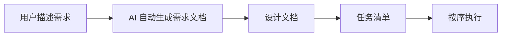
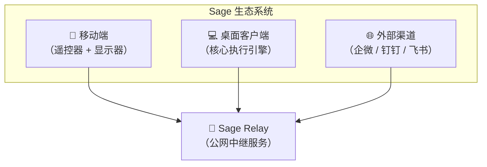
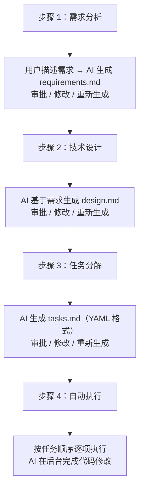

# Sage 使用手册

> 历史归档：保留原始记录，不作为当前版本的操作或接口规范。当前入口见 [文档索引](../README.md)。

## 📖 项目概述

**Sage** 是一个 AI 编程助手平台，将 Claude Code 的强大能力封装在 Qoder 风格的 Spec 驱动工作流中。支持多端协作：桌面客户端、移动远程控制、外部渠道集成。

### 核心理念



### 系统架构



---

## 💻 客户端（桌面应用）

### 安装

#### 系统要求
- macOS 12+
- Node.js 20+
- Claude Code CLI（需预先安装）

#### 安装步骤

```bash
# 1. 下载 DMG
release/Sage-0.1.0-arm64.dmg

# 2. 双击安装，将 Sage.app 拖到 Applications 文件夹

# 3. 首次运行需在「系统设置 → 隐私与安全性」中允许
```

### 快速开始

#### 1. 打开项目

```bash
# 启动 Sage
open /Applications/Sage.app

# 点击左侧「📂 打开项目」，选择你的代码目录
```

#### 2. 创建对话

- 点击侧边栏「+ 新建对话」
- 在输入框描述你的需求
- 按 Enter 发送，Shift+Enter 换行

#### 3. 使用 Spec 工作流



### 界面导航

#### 侧边栏

```
┌─────────────────────────────────┐
│ 📂 打开项目                      │  ← 打开项目目录
├─────────────────────────────────┤
│ 📋 对话                          │
│   + 新建对话                     │
│   ├─ 对话 1                     │
│   ├─ 对话 2                     │  ← 点击切换
│   └─ ...                        │
├─────────────────────────────────┤
│ 📄 Spec 工作流                   │
│   + 新建 Spec                    │
│   ├─ Spec 1                     │
│   └─ ...                        │
├─────────────────────────────────┤
│ 📁 项目文件                      │  ← 文件树
├─────────────────────────────────┤
│ ⚙️ 底部菜单                      │
│   ├─ ⏰ 定时任务                  │
│   ├─ 📢 通知渠道                  │
│   ├─ ⚙ 设置                     │
│   └─ ℹ️ 关于                    │
└─────────────────────────────────┘
```

#### 主区域

```
┌─────────────────────────────────────────────┐
│ 对话标题                    [⚙️] [🔔] [📊] │
├─────────────────────────────────────────────┤
│                                             │
│  用户消息                                    │
│  ┌────────────────────────────────────┐    │
│  │ 帮我实现一个登录功能                 │    │
│  │                                    │    │
│  │ [复制][下载][删除]            14:32 │    │
│  └────────────────────────────────────┘    │
│                                             │
│  AI 回复                                 │
│  ┌────────────────────────────────────┐    │
│  │ 好的，我来帮你实现登录功能...         │    │
│  │                                    │    │
│  │ [复制][下载][删除]            14:32 │    │
│  └────────────────────────────────────┘    │
│                                             │
├─────────────────────────────────────────────┤
│ [模型▼] [🔔] [ctx] [📥]          [发送▼]  │
│ ┌─────────────────────────────────────┐    │
│ │ 输入消息...                           │    │
│ └─────────────────────────────────────┘    │
└─────────────────────────────────────────────┘
```

### 核心功能

#### 1. 对话管理

- **新建对话**：点击「+」或 Cmd+N
- **重命名**：双击对话标题
- **删除**：右键对话 → 删除
- **导出图片**：点击 📥 按钮，保存完整对话为图片

#### 2. 消息操作

- **复制**：悬停消息 → 点击复制图标
- **删除**：悬停消息 → 点击删除图标
- **保存为图片**：悬停消息 → 点击下载图标
- **查看时间**：每条消息右下角显示时间戳
- **查看图片**：点击消息中的图片缩略图 → 放大查看

#### 3. 消息排队

当 AI 正在回复时，你可以继续输入并发送：

```
┌─────────────────────────────────────────────┐
│ 队列消息面板                                  │
│ ┌─────────────────────────────────────┐    │
│ │ ☰ 消息 1                      [×]   │    │  ← 拖拽排序
│ │ ☰ 消息 2                      [×]   │    │
│ │ ☰ 消息 3                      [×]   │    │
│ └─────────────────────────────────────┘    │
│ 提示：AI 完成后自动执行队列中的消息      │
└─────────────────────────────────────────────┘
```

- **拖拽重排**：拖动 ☰ 图标调整顺序
- **删除单条**：点击 × 按钮
- **自动执行**：当前任务完成后自动处理下一条

#### 4. 智能发送按钮

输入框右下角的发送按钮：

- **单击**：发送消息
- **长按 500ms**：弹出「停止 AI」确认弹窗
- **队列中有消息**：图标变为 🕐（时钟）或 📋（列表）

#### 5. Spec 工作流

点击侧边栏「📋 工作流」：

```
┌─────────────────────────────────────────────┐
│ Spec: 实现用户登录                            │
├─────────────────────────────────────────────┤
│ [📝 需求] [🎨 设计] [✅ 任务] [▶ 执行]      │
├─────────────────────────────────────────────┤
│                                             │
│ 需求文档                                     │
│ ┌─────────────────────────────────────┐    │
│ │ # 用户登录功能                        │    │
│ │                                      │    │
│ │ ## 功能要求                           │    │
│ │ - 支持用户名密码登录                  │    │
│ │ - 支持第三方登录（GitHub）            │    │
│ └─────────────────────────────────────┘    │
│                                             │
│ [✓ 批准] [✎ 编辑] [🔄 重新生成]             │
└─────────────────────────────────────────────┘
```

**工作流阶段**：
1. **需求分析**：生成 requirements.md
2. **技术设计**：生成 design.md
3. **任务分解**：生成 tasks.md（YAML 格式）
4. **自动执行**：按任务顺序执行代码修改

#### 6. 定时任务

点击侧边栏「⏰ 定时任务」：

```
┌─────────────────────────────────────────────┐
│ 定时任务管理                                  │
├─────────────────────────────────────────────┤
│ [+ 新建任务]                                 │
├─────────────────────────────────────────────┤
│ ┌─────────────────────────────────────┐    │
│ │ 每日代码审查                    [▶] │    │
│ │ 每天 09:00 执行                     │    │
│ │ Prompt: 检查最近24小时的代码变更...   │    │
│ └─────────────────────────────────────┘    │
│                                             │
│ ┌─────────────────────────────────────┐    │
│ │ 每小时状态报告                  [⏸] │    │
│ │ 每小时的第30分钟执行                 │    │
│ │ Prompt: 汇总当前项目状态...          │    │
│ └─────────────────────────────────────┘    │
└─────────────────────────────────────────────┘
```

**任务类型**：
- **一次性**：指定时间执行
- **每小时**：每小时的第 N 分钟
- **每天**：每天 HH:mm
- **每周**：每周几 HH:mm
- **每月**：每月几号 HH:mm
- **间隔**：每 N 分钟

**绑定通知渠道**：
- 点击任务卡片 → 选择通知渠道
- 任务执行完成后自动推送结果到企微/钉钉/飞书

#### 7. 通知渠道

点击侧边栏「📢 通知渠道」：

```
┌─────────────────────────────────────────────┐
│ 通知渠道管理                                  │
├─────────────────────────────────────────────┤
│ [+ 新建渠道]                                 │
├─────────────────────────────────────────────┤
│ ┌─────────────────────────────────────┐    │
│ │ 📧 企业微信-研发组                  │    │
│ │ Webhook: https://qyapi...           │    │
│ │ [测试] [编辑] [删除]                │    │
│ └─────────────────────────────────────┘    │
│                                             │
│ ┌─────────────────────────────────────┐    │
│ │ 💬 钉钉-技术部                      │    │
│ │ Webhook: https://oapi...            │    │
│ │ [测试] [编辑] [删除]                │    │
│ └─────────────────────────────────────┘    │
└─────────────────────────────────────────────┘
```

**支持的渠道**：
- 📧 企业微信
- 💬 钉钉
- 🐦 飞书
- 📮 邮件

**配置步骤**：
1. 点击「+ 新建渠道」
2. 选择渠道类型
3. 填写 Webhook URL
4. 测试发送
5. 保存

#### 8. 使用统计

点击对话顶部「📊」图标：

```
┌─────────────────────────────────────────────┐
│ 📊 使用统计                                 │
├─────────────────────────────────────────────┤
│ 输入 tokens: 61.0M  输出 tokens: 411.6k     │
│ 预估费用: $44.41                             │
├─────────────────────────────────────────────┤
│ 分钟（最近 60 分钟）                          │
│ ┌─────────────────────────────────────┐    │
│ │ ●输入 ●输出 ●费用                   │    │
│ │   ╭─╮                               │    │
│ │ ╭─╯  ╰─╮  ← 输入/输出(tokens)       │    │
│ │ ╱       ╲                           │    │
│ │ ───────────  ← 费用($)              │    │
│ └─────────────────────────────────────┘    │
│                                             │
│ 小时（最近 48 小时）                          │
│ ┌─────────────────────────────────────┐    │
│ │ ...                                 │    │
│ └─────────────────────────────────────┘    │
│                                             │
│ 日 / 月 / 年 ...                            │
└─────────────────────────────────────────────┘
```

**统计维度**：
- 分钟：最近 60 分钟
- 小时：最近 48 小时
- 日：最近 30 天
- 月：最近 12 个月
- 年：全部年份

**指标**：
- 输入 tokens（蓝色）
- 输出 tokens（绿色）
- 预估费用（橙色）

#### 9. 技能系统（Skills）

Sage 支持项目级和全局级技能：

**项目级技能**（仅当前项目生效）：
```
<project>/.sage/skills/
├── code-review.md
└── api-design.md
```

**全局技能**（所有项目共享）：
```
~/Library/Application Support/Sage/skills/
├── git-commit.md
└── database-design.md
```

**技能文件格式**：
```markdown
---
name: 代码审查专家
description: 专业的代码审查技能，关注可读性、可维护性和安全性
---

# 代码审查技能

## 审查要点

1. **可读性**
   - 变量命名是否清晰
   - 代码结构是否合理
   - 注释是否充分

2. **可维护性**
   - 是否遵循 SOLID 原则
   - 是否有重复代码
   - 依赖是否合理

3. **安全性**
   - 是否有 SQL 注入风险
   - 是否有 XSS 漏洞
   - 敏感信息是否暴露
```

#### 10. 文件导航栏

对话右侧的导航栏（梳子状时间线）：

```
┌──────────────┐
│  ─ ─ ─ ─     │  ← 消息刻度线
│    ───       │  ← 当前消息（长横线）
│  ─ ─ ─       │
│    ─         │
│  ─ ─ ─ ─ ─   │
└──────────────┘
```

**操作**：
- **点击刻度**：跳转到对应消息
- **悬停**：显示消息内容预览
- **拖拽**：按住上下拖动，实时跳转

### 高级功能

#### 1. 工具权限控制

设置 → 权限模式：

- **plan**（默认）：只读，不会修改代码
- **acceptEdits**：自动接受文件编辑，但 bash/网络仍会提示
- **default**：每次工具调用都提示
- **bypassPermissions**：危险，自动接受所有操作

#### 2. 图片输入

支持拖拽或粘贴图片到对话：

```
┌─────────────────────────────────────────────┐
│ ┌──────┐  ← 图片缩略图                       │
│ │  🖼️  │     [×] 移除                         │
│ └──────┘                                    │
│ ┌─────────────────────────────────────┐    │
│ │ 请分析这张图片...                     │    │
│ └─────────────────────────────────────┘    │
└─────────────────────────────────────────────┘
```

**支持格式**：PNG、JPEG、GIF、WebP
**大小限制**：5MB

#### 3. 上下文监控

输入框左侧的 ctx 指标：

```
┌─────────────────────────────────────────────┐
│ ctx: 32.5k [████████░░] 75%                │
│ 复用: 60%  重建: 40%                        │
└─────────────────────────────────────────────┘
```

**含义**：
- **总 tokens**：当前对话上下文大小
- **复用率**：缓存命中率（越高越好，节省费用）
- **重建率**：需要重新计算的部分

#### 4. 多模型支持

设置 → 模型档案：

```
┌─────────────────────────────────────────────┐
│ 模型档案管理                                  │
├─────────────────────────────────────────────┤
│ [+ 新建档案]                                 │
├─────────────────────────────────────────────┤
│ ┌─────────────────────────────────────┐    │
│ │ Claude Sonnet 4                     │    │
│ │ API: Anthropic                      │    │
│ │ Model: claude-sonnet-4-20250514     │    │
│ │ [编辑] [删除]                       │    │
│ └─────────────────────────────────────┘    │
│                                             │
│ ┌─────────────────────────────────────┐    │
│ │ GPT-4o                              │    │
│ │ API: OpenAI                         │    │
│ │ Model: gpt-4o                       │    │
│ │ [编辑] [删除]                       │    │
│ └─────────────────────────────────────┘    │
└─────────────────────────────────────────────┘
```

**支持的协议**：
- Anthropic Messages API
- OpenAI Chat Completions API
- 第三方兼容端点

**使用方式**：
- 对话中选择模型档案
- 或跟随项目默认设置

#### 5. 中继服务器（Relay）

解决本地无公网 IP 的问题：

**架构**：


**配置步骤**：

1. 在 Relay 服务器创建客户端，获取 token
2. 设置 → 中继服务器：
   - URL: https://relay.example.com
   - Token: your-client-token
   - 点击「连接」

3. 状态显示「已连接」后，每个渠道会生成公网可访问的 Webhook URL

**使用场景**：
- 企业微信/钉钉/飞书回调
- 移动端远程控制
- 第三方集成

### 数据存储

#### 项目数据

```
<project>/.sage/
├── specs/
│   ├── <spec-id>/
│   │   ├── meta.json          # Spec 元数据
│   │   ├── requirements.md    # 需求文档
│   │   ├── design.md          # 设计文档
│   │   └── tasks.md           # 任务清单
├── convs/
│   └── <conv-id>.json         # 对话历史
├── scheduled/
│   ├── tasks.json             # 定时任务
│   └── runs/                  # 执行记录
├── channels/
│   └── channels.json          # 通知渠道配置
└── skills/
    └── *.md                   # 项目级技能
```

#### 应用数据

```
~/Library/Application Support/Sage/
├── settings.json              # 全局设置
├── projects.json              # 项目列表
├── skills/                    # 全局技能
└── usage-timeline.json        # 使用时间线（永久保存）
```

### 常见问题

#### Q: AI 执行失败了怎么办？

A: 检查以下几点：
1. Claude Code CLI 是否安装并能在终端运行
2. API Key 是否正确（如使用 API 模式）
3. 权限模式是否设置为 `bypassPermissions`
4. 查看终端日志：`~/Library/Logs/Sage/main.log`

#### Q: 定时任务没有自动执行？

A: 确认：
1. 任务状态为「启用」
2. 应用保持运行状态
3. 查看定时任务视图中的「下次运行时间」
4. 检查应用启动日志是否有调度器错误

#### Q: 如何删除对话但保留统计数据？

A: 直接删除对话即可。统计数据（使用时间线）独立于对话，删除对话不会丢失统计。

#### Q: 移动端如何连接？

A: 
1. 配置 Relay 服务器（见「中继服务器」章节）
2. 移动端 App 登录时输入 Relay URL 和 Token
3. 确保桌面客户端已启动并保持运行

---

## 🌐 服务端（Relay 服务器）

### 架构说明

Sage Relay 是一个可选的公网中继服务，解决以下问题：
- 本地客户端无公网 IP，无法接收外部平台回调
- 移动端需要通过公网连接本地客户端

### 部署

#### 系统要求
- Node.js 20+
- 公网 IP 或域名
- SSL 证书（推荐）

#### 安装

```bash
git clone https://github.com/your-org/sage-website.git
cd sage-website
npm install
```

#### 配置

创建 `.env` 文件：

```env
# 服务器端口
PORT=3000

# WebSocket 路径
WS_PATH=/ws

# 客户端管理
MAX_CLIENTS=100
CLIENT_TOKEN_EXPIRES=30d

# 日志级别
LOG_LEVEL=info

# HTTPS（推荐）
SSL_KEY=/path/to/key.pem
SSL_CERT=/path/to/cert.pem
```

#### 启动

```bash
# 开发模式
npm run dev

# 生产模式
npm start

# 使用 PM2（推荐）
pm2 start ecosystem.config.js
```

### API 接口

#### 客户端认证

```http
POST /mobile/auth
Content-Type: application/json

{
  "token": "client-token-xxx"
}
```

**响应**：
```json
{
  "status": "ok",
  "sessionId": "session-xxx",
  "webhookToken": "webhook-token-xxx"
}
```

#### 下发命令

```http
POST /mobile/command
Content-Type: application/json

{
  "sessionId": "session-xxx",
  "requestId": "req-xxx",
  "action": "list_projects",
  "payload": {}
}
```

**支持的 action**：
- `ping`：链路测试
- `get_status`：获取客户端状态
- `list_projects`：列出项目
- `list_conversations`：列出对话
- `list_tasks`：列出定时任务
- `create_conversation`：创建对话
- `list_messages`：获取对话消息
- `create_task`：创建定时任务
- `update_task`：更新任务
- `delete_task`：删除任务
- `run_task_now`：立即执行任务

#### Webhook 转发

外部平台回调地址格式：
```
https://relay.example.com/webhook/{webhookPath}
```

Relay 会将请求通过 WebSocket 转发给对应的客户端。

### 监控

#### 查看连接状态

```bash
curl http://localhost:3000/status
```

**响应**：
```json
{
  "clients": 5,
  "sessions": 8,
  "uptime": 86400
}
```

#### 日志

```bash
# 查看实时日志
tail -f logs/relay.log

# 查看错误日志
tail -f logs/error.log
```

---

## 📱 移动端（React Native）

### 安装

#### 开发环境

```bash
cd tools/sage-mobile

# 安装依赖
npm install

# 启动 Expo 开发服务器
npm start

# 在 iOS 模拟器运行
npm run ios

# 在 Android 模拟器运行
npm run android
```

#### 构建

```bash
# iOS
npm run build:ios

# Android APK
npm run build:android
```

### 功能说明

移动端是「遥控器 + 显示器」模式，**零执行能力**：
- 所有 AI 推理在桌面客户端完成
- 移动端只负责下发指令和展示结果
- 断网不影响桌面端已触发的任务

### 登录

```
┌─────────────────────────────────────┐
│  🧠 Sage                            │
├─────────────────────────────────────┤
│                                     │
│  Relay URL                          │
│  ┌───────────────────────────────┐ │
│  │ https://relay.example.com     │ │
│  └───────────────────────────────┘ │
│                                     │
│  Token                              │
│  ┌───────────────────────────────┐ │
│  │ client-token-xxx              │ │
│  └───────────────────────────────┘ │
│                                     │
│  [登录]                             │
└─────────────────────────────────────┘
```

**获取 Token**：
1. 在桌面客户端配置 Relay 服务器
2. 在 Relay 服务器创建客户端，获取 Token
3. 移动端输入 Relay URL 和 Token

### 页面导航

#### 1. 项目列表

```
┌─────────────────────────────────────┐
│  📁 项目                      [↻]  │
├─────────────────────────────────────┤
│ ┌─────────────────────────────────┐ │
│ │ 📁 my-project                   │ │
│ │ 最后打开: 2026-08-16           │ │
│ │ [选择]                          │ │
│ └─────────────────────────────────┘ │
│                                     │
│ ┌─────────────────────────────────┐ │
│ │ 📁 another-project              │ │
│ │ 最后打开: 2026-08-15           │ │
│ │ [选择]                          │ │
│ └─────────────────────────────────┘ │
└─────────────────────────────────────┘
```

#### 2. 对话列表

```
┌─────────────────────────────────────┐
│  💬 对话                      [+]  │
├─────────────────────────────────────┤
│ [全部] [最近] [收藏]                │
├─────────────────────────────────────┤
│ ┌─────────────────────────────────┐ │
│ │ 实现用户登录功能                  │ │
│ │ 消息数: 24  更新: 2小时前       │ │
│ └─────────────────────────────────┘ │
│                                     │
│ ┌─────────────────────────────────┐ │
│ │ 修复 Bug #123                   │ │
│ │ 消息数: 8   更新: 1天前         │ │
│ └─────────────────────────────────┘ │
└─────────────────────────────────────┘
```

#### 3. 对话详情

```
┌─────────────────────────────────────┐
│  ← 对话标题                         │
├─────────────────────────────────────┤
│                                     │
│  ┌───────────────────────────────┐ │
│  │ 用户                          │ │
│  │ 帮我实现登录功能...            │ │
│  └───────────────────────────────┘ │
│                                     │
│  ┌───────────────────────────────┐ │
│  │ Claude                        │ │
│  │ 好的，我来帮你实现登录功能...   │ │
│  └───────────────────────────────┘ │
│                                     │
├─────────────────────────────────────┤
│ 输入消息...                  [发送] │
└─────────────────────────────────────┘
```

#### 4. 定时任务

```
┌─────────────────────────────────────┐
│  ⏰ 定时任务                  [+]  │
├─────────────────────────────────────┤
│ ┌─────────────────────────────────┐ │
│ │ 每日代码审查              [▶]   │ │
│ │ 每天 09:00                     │ │
│ │ 启用: ✅                        │ │
│ └─────────────────────────────────┘ │
│                                     │
│ ┌─────────────────────────────────┐ │
│ │ 每小时状态报告            [⏸]   │ │
│ │ 每小时的第30分钟               │ │
│ │ 启用: ❌                        │ │
│ └─────────────────────────────────┘ │
└─────────────────────────────────────┘
```

#### 5. 系统监控

```
┌─────────────────────────────────────┐
│  📊 系统状态                  [↻]  │
├─────────────────────────────────────┤
│                                     │
│  CPU 使用率                         │
│  ┌───────────────────────────────┐ │
│  │ ████████░░░░░░░░ 45%          │ │
│  └───────────────────────────────┘ │
│                                     │
│  内存使用                           │
│  ┌───────────────────────────────┐ │
│  │ ████████████░░░ 8.2 / 16 GB   │ │
│  └───────────────────────────────┘ │
│                                     │
│  运行时间: 2天 5小时               │
│  平台: darwin arm64                │
│  Node: v20.11.0                    │
└─────────────────────────────────────┘
```

### 支持的指令

移动端通过 Relay 向桌面客户端下发指令：

| 指令 | 说明 | 示例 |
|------|------|------|
| `ping` | 链路测试 | 验证连接是否正常 |
| `get_status` | 获取系统状态 | 查看 CPU/内存/运行时间 |
| `list_projects` | 列出项目 | 显示所有项目列表 |
| `list_conversations` | 列出对话 | 显示指定项目的对话 |
| `list_tasks` | 列出定时任务 | 显示所有任务 |
| `create_conversation` | 创建对话 | 新建一个对话 |
| `list_messages` | 获取消息 | 查看对话历史 |
| `create_task` | 创建任务 | 新建定时任务 |
| `update_task` | 更新任务 | 修改任务配置 |
| `delete_task` | 删除任务 | 删除定时任务 |
| `run_task_now` | 立即执行 | 手动触发任务 |

### 推送通知

移动端支持接收推送通知：

```bash
# 任务完成通知
{
  "title": "定时任务完成",
  "body": "每日代码审查 - 成功",
  "data": {
    "taskId": "task-xxx",
    "convId": "conv-xxx"
  }
}
```

**配置**：
1. 在任务中绑定通知渠道
2. 任务完成后自动推送到绑定的渠道
3. 移动端收到通知后可查看详情

---

## 🔗 外部渠道集成

### 企业微信

#### 配置步骤

1. 在企业微信群中创建机器人
2. 复制 Webhook URL
3. 在 Sage 中新建渠道 → 选择「企业微信」
4. 粘贴 Webhook URL
5. 测试发送

**Webhook URL 格式**：
```
https://qyapi.weixin.qq.com/cgi-bin/webhook/send?key=xxx
```

#### 消息格式

```json
{
  "msgtype": "text",
  "text": {
    "content": "Sage 任务执行完成\n\n任务: 每日代码审查\n状态: 成功\n耗时: 2分钟"
  }
}
```

### 钉钉

#### 配置步骤

1. 在钉钉群中创建自定义机器人
2. 复制 Webhook URL（含 access_token）
3. 在 Sage 中新建渠道 → 选择「钉钉」
4. 粘贴 Webhook URL
5. 测试发送

**Webhook URL 格式**：
```
https://oapi.dingtalk.com/robot/send?access_token=xxx
```

#### 安全设置

- **加签**：支持 Secret 签名验证
- **关键词**：消息必须包含指定关键词

### 飞书

#### 配置步骤

1. 在飞书群中创建机器人
2. 复制 Webhook URL
3. 在 Sage 中新建渠道 → 选择「飞书」
4. 粘贴 Webhook URL
5. 测试发送

**Webhook URL 格式**：
```
https://open.feishu.cn/open-apis/bot/v2/hook/xxx
```

### 邮件

#### 配置步骤

1. 在 Sage 中新建渠道 → 选择「邮件」
2. 填写 SMTP 配置：
   - 服务器：smtp.gmail.com
   - 端口：587
   - 用户名：your-email@gmail.com
   - 密码：应用专用密码
3. 填写收件人列表
4. 测试发送

#### 邮件模板

```markdown
Subject: [Sage] 任务执行通知

## 任务执行完成

**任务名称**: 每日代码审查
**执行时间**: 2026-08-16 09:00:00
**状态**: ✅ 成功
**耗时**: 2分钟 15秒

### 执行结果

[查看对话详情](https://sage.example.com/conv/xxx)
```

---

## 🛠 开发者指南

### 项目结构

```
sage/
├── electron/                 # 主进程（Node）
│   ├── main.ts              # 入口、窗口管理
│   ├── preload.ts           # contextBridge API
│   ├── ipc.ts               # IPC 通道注册
│   ├── conv-engine.ts       # 对话引擎
│   ├── scheduler.ts         # 定时任务调度器
│   ├── mobile-bridge.ts     # 移动端指令处理
│   ├── skills.ts            # 技能系统
│   ├── channels/            # 渠道集成
│   │   ├── inbound-server.ts  # 本地 Webhook 服务器
│   │   ├── relay-client.ts    # Relay 客户端
│   │   ├── wechat.ts          # 企业微信
│   │   ├── dingtalk.ts        # 钉钉
│   │   ├── feishu.ts          # 飞书
│   │   └── registry.ts        # 渠道注册表
├── src/                     # 渲染进程（React）
│   ├── components/          # UI 组件
│   ├── stores/appStore.ts   # Zustand 状态管理
│   └── styles/index.css     # 全局样式
├── shared/
│   └── types.ts             # 共享类型定义
└── tools/
    └── sage-mobile/         # 移动端应用
        ├── app/             # React Native 页面
        └── package.json
```

### 开发环境

```bash
# 安装依赖
npm install

# 启动开发服务器
npm run dev

# 构建
npm run build

# 打包 DMG
bash scripts/sign-local.sh
```

### 添加新渠道

1. 在 `electron/channels/` 创建新文件（如 `slack.ts`）
2. 实现 `ChannelAdapter` 接口：

```typescript
export interface ChannelAdapter {
  type: string;
  label: string;
  fields: ChannelField[];
  
  send(config: ChannelConfig, message: ChannelMessage): Promise<void>;
  parseInbound(req: InboundRequest): Promise<InboundParseResult | null>;
}
```

3. 在 `registry.ts` 中注册：

```typescript
import { slackAdapter } from './slack';
registerAdapter(slackAdapter);
```

### 添加新移动端指令

1. 在 `electron/mobile-bridge.ts` 中注册处理器：

```typescript
registerMobileAction('new_action', async (payload) => {
  // 处理逻辑
  return {
    status: 200,
    data: { result: 'xxx' }
  };
});
```

2. 在移动端 `app/src/api/relay.ts` 中添加方法：

```typescript
async newAction(payload: any): Promise<any> {
  return this.sendCommand('new_action', payload);
}
```

### 调试技巧

#### 查看日志

```bash
# 主进程日志
tail -f ~/Library/Logs/Sage/main.log

# 渲染进程日志（开发模式）
# 打开 DevTools: Cmd+Option+I
```

#### 检查 Relay 连接

```bash
# 在设置中查看 Relay 状态
# 或检查日志中的 [relay-client] 相关行
```

#### 测试定时任务

```bash
# 在定时任务视图中点击「立即执行」
# 或修改任务时间为未来 1 分钟
```

---

## 📚 附录

### 快捷键

| 快捷键 | 功能 |
|--------|------|
| `Cmd+N` | 新建对话 |
| `Cmd+Shift+N` | 新建 Spec |
| `Cmd+,` | 打开设置 |
| `Cmd+Option+I` | 打开 DevTools |
| `Cmd+W` | 关闭窗口 |
| `Enter` | 发送消息 |
| `Shift+Enter` | 换行 |
| `Cmd+Enter` | 发送消息（备用） |

### 环境变量

| 变量 | 说明 | 默认值 |
|------|------|--------|
| `NODE_ENV` | 运行环境 | `production` |
| `LOG_LEVEL` | 日志级别 | `info` |
| `RELAY_URL` | Relay 服务器地址 | - |
| `RELAY_TOKEN` | Relay 客户端 Token | - |

### 文件路径

| 类型 | 路径 |
|------|------|
| 应用数据 | `~/Library/Application Support/Sage/` |
| 应用日志 | `~/Library/Logs/Sage/` |
| 项目数据 | `<project>/.sage/` |
| 全局技能 | `~/Library/Application Support/Sage/skills/` |
| 项目技能 | `<project>/.sage/skills/` |

### 定价参考

Claude Sonnet 定价（每百万 tokens）：
- 输入：$3
- 输出：$15
- 缓存读取：$0.30
- 缓存写入：$3.75

### 相关链接

- [Claude Code 文档](https://docs.claude.com/en/docs/claude-code)
- [Anthropic API 文档](https://docs.anthropic.com/en/api/getting-started)
- [OpenAI API 文档](https://platform.openai.com/docs/api-reference)
- [Electron 文档](https://www.electronjs.org/docs)
- [React Native 文档](https://reactnative.dev/docs/getting-started)

---

## 🐛 故障排除

### 常见问题

#### 1. Claude CLI 找不到

**错误**：`claude command not found`

**解决**：
```bash
# 检查 Claude Code 是否安装
claude --version

# 如未安装，访问 https://claude.ai/download
# 或运行：npm install -g @anthropic-ai/claude-code
```

#### 2. API Key 无效

**错误**：`Invalid API key`

**解决**：
1. 检查 API Key 是否正确复制
2. 确认 API Key 未过期
3. 检查是否使用了正确的端点（Anthropic vs OpenAI）

#### 3. 定时任务不执行

**错误**：任务到时间但没有触发

**解决**：
1. 确认应用保持运行状态
2. 检查任务状态是否为「启用」
3. 查看日志：`grep "scheduler" ~/Library/Logs/Sage/main.log`
4. 重启应用

#### 4. Relay 连接失败

**错误**：`WebSocket connection failed`

**解决**：
1. 检查 Relay URL 是否正确
2. 确认 Token 有效
3. 检查网络连接
4. 查看 Relay 服务器日志

#### 5. 移动端无法登录

**错误**：`Authentication failed`

**解决**：
1. 确认 Relay 服务器已启动
2. 检查 Token 是否正确
3. 确认移动端和 Relay 在同一网络
4. 重启 Relay 服务器

### 性能优化

#### 减少 Token 消耗

1. **提高缓存命中率**：
   - 避免频繁切换对话
   - 复用已有对话而非新建

2. **精简上下文**：
   - 定期清理不重要的对话
   - 使用简短的 prompt

3. **选择合适的模型**：
   - 简单任务使用小模型
   - 复杂任务使用大模型

#### 优化定时任务

1. **合理设置频率**：
   - 避免过于频繁（如每分钟）
   - 根据实际需求设置

2. **绑定通知渠道**：
   - 任务完成后自动通知
   - 避免频繁查看

3. **监控执行日志**：
   - 定期检查执行记录
   - 清理过期任务

---

## 📝 更新日志

### v0.1.0 (2026-08-16)

**新增**：
- ✅ 完整的使用手册
- ✅ 消息时间戳显示
- ✅ 消息操作项位置调整
- ✅ 使用统计图表优化
- ✅ 定时任务自动加载
- ✅ 统计数据持久化
- ✅ 全局技能系统
- ✅ 移动端支持

**修复**：
- 🐛 删除对话后统计清零
- 🐛 定时任务不自动执行
- 🐛 placeholder 显示错误

**优化**：
- ⚡ 改进消息排队体验
- ⚡ 优化图表渲染性能
- ⚡ 提升移动端响应速度

---

## 📞 支持

如有问题或建议，请通过以下方式联系：

- 📧 Email: support@sage.dev
- 💬 微信群: 扫码加入
- 🐛 GitHub Issues: https://github.com/your-org/sage/issues

---

**最后更新**: 2026-08-16  
**版本**: v0.1.0
