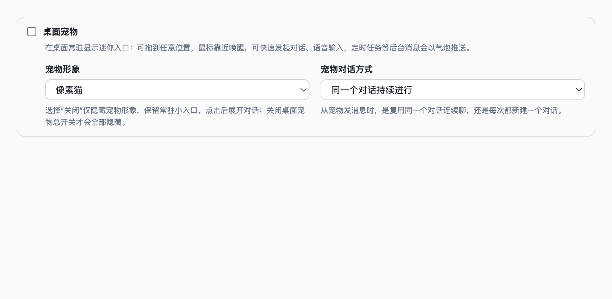
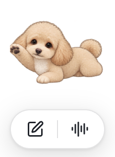
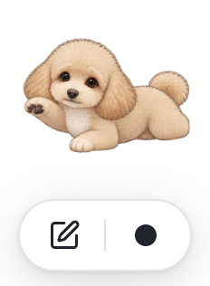
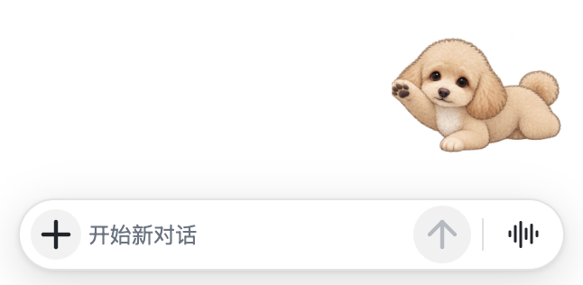
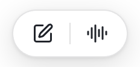
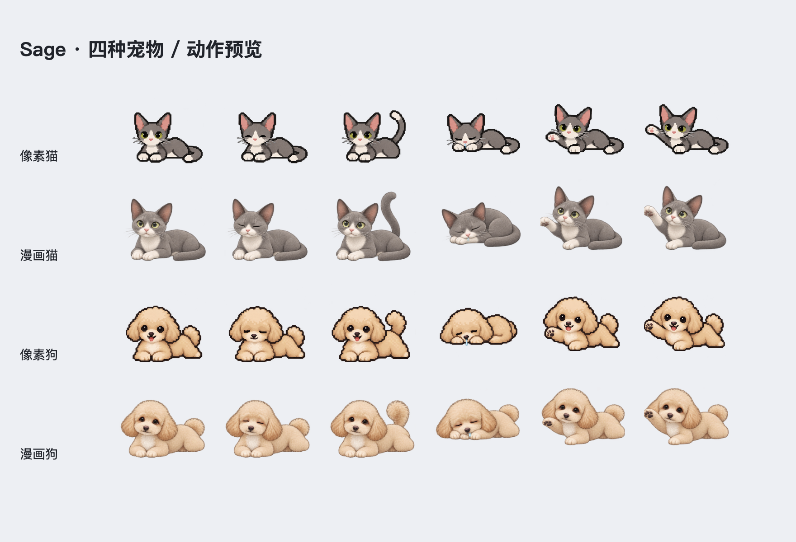
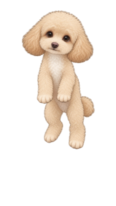
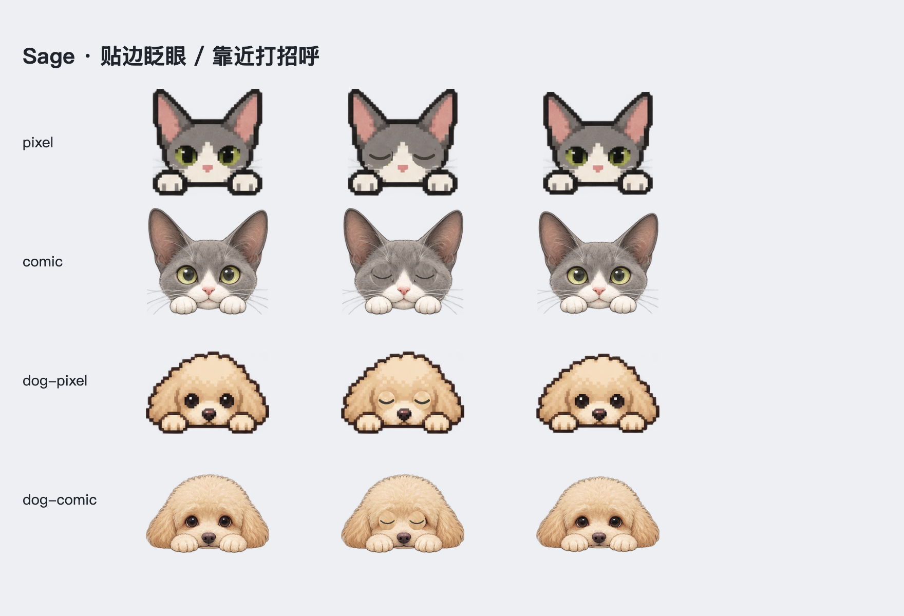
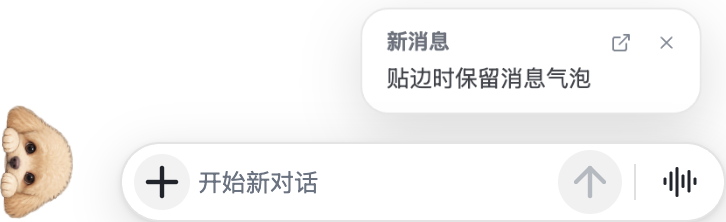
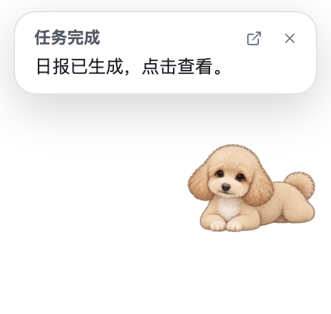

# 桌面宠物

当前版本：0.6.816。设置 → 通用 → 桌面宠物启用；形象可选像素猫、漫画猫、像素狗、漫画狗，也可在宠物右键菜单切换。猫依据用户提供的灰白猫照片，狗依据浅杏色卷毛狗照片制作。四种形象均支持四边与四角探头，保留连续对话与语音功能。

总开关、形象和对话方式合并在同一设置区；形象与对话方式并排，窄窗口自动换行。关闭总开关保留已选配置，重新开启即可继续使用。

## 小入口与对话

宠物始终保留。鼠标靠近时，**宠物正下方**显示 96 × 40 的双按钮小胶囊：编辑图标、分隔线、语音图标。点击编辑才展开 303 × 40 的输入条（未选项目，CSS 像素）；语音按钮直接开始录音，录音中变成黑色圆点，点击黑点停止。有转写但未选项目时展开输入条供确认。Escape 返回双按钮小入口。离开约 300ms 后隐藏入口和输入条，保留草稿、项目和语音会话；宠物位置不随展开收起改变。

形象选择 **关闭** 时只隐藏宠物，小入口常驻；点击后展开输入条，鼠标离开也不会收起，Escape 返回小入口。关闭“桌面宠物”总开关才会一起关闭。无形象时不会贴边或留下探头。

## 待机和鼠标互动

四种形象都有趴卧、眨眼、露尾轻摆、打盹流口水、伸爪的补充动作，穿插原来的转身、睡觉、翘尾和伸懒腰。鼠标位于宠物左右及周围约 18px 时持续伸爪，停住也继续；左侧靠近向左、右侧靠近向右。移到宠物下方、按钮或窗口外时立即停止并恢复待机；无须点击。页面隐藏或系统开启“减少动态效果”时停用自动动画；拖拽时暂停待机与抓鼠标。

按住全身拖动会切换为悬空垂爪姿态，围绕颈部轻摆；松手后约半秒下落回弹，落在释放位置附近。这里的“落地”是宠物原地的视觉落点，不会自行滑落到屏幕底部。悬空画布由 96 × 96 调整为 96 × 144，去掉原来的 0.88 倍缩放，颈部抓取点随窗口调整，修复提起时身体被压进正方形而突然缩小的问题。

拖到显示器可见工作区边缘时自动贴进去，只露头和爪：左边朝右、右边朝左、上边朝下、下边朝上。拖到左上、右上、左下、右下角时，头和爪沿对角朝屏幕内部探出；两个方向同时固定，展开输入框或消息也留在原角落。探头轻点向内跑出，四角沿对角出来；按住移动超过 4px 后成为拖动，松开不再误触“跑出来”。鼠标一直沿边移动，探头沿边跟随；向屏幕内拉开超过约 48 点后露出被拎起的全身，拖动不中断。菜单栏和 Dock 不属于可见工作区。位置及贴边方向保存到本机 `pet-state.json`，不随设置备份迁移。

探头待机会自然眨眼，鼠标靠近时轻轻点头打招呼。每次进入招呼一次，持续停留不会反复重启动作；拖动、页面隐藏或“减少动态效果”暂停动画。眼皮使用原图的毛发纹理，招呼动作使用完整形象轻轻点头，不增加外部素材请求。

贴边时继续显示编辑、语音入口和消息气泡，展开方向固定朝屏幕内侧：

| 贴边位置 | 对话框、项目面板和气泡方向 |
| --- | --- |
| 左 | 右 |
| 右 | 左 |
| 上 | 下 |
| 下 | 上 |
| 左上 / 右上 | 右下 / 左下 |
| 左下 / 右下 | 右上 / 左上 |

鼠标离开只收起工具，保留草稿；收到新消息也保持探头贴边。只有轻点探头或拖向内侧才出来。

## 消息气泡

活动列表中新到的版本/渠道/系统消息会同步冒泡；定时任务的完成或失败提示也有可点击气泡。任务仍遵守原来的静默输出及条件通知设置；宠物气泡与 macOS 系统通知开关独立。

- 气泡约 8 秒后收起，也可关闭；点击消息打开对应活动或任务执行对话。
- 贴边时有新消息向屏幕内部展开，探头保持原位；拖拽中收到消息等松手后展示。
- 正在显示宠物回复时，通知排队，不覆盖回复。保留最近 5 条待显示通知。
- 相同消息在短时间内去重，同一渠道的不同正文各自显示。关闭后重新开启宠物不会重放历史活动。
- 自动冒泡不激活主窗口；只有点击查看才打开。原活动窗口已关闭时，在新窗口恢复这条被点击的活动。

0.6.848 起，任务气泡清理 Markdown 格式标记并保留段落，截断时显示省略号；表格保留列名和值。完整结果继续在对应对话里查看。详见[可读通知摘要与验证](NOTIFICATION_SUMMARIES.md)。

## 启动与验证

透明背景在 HTML 首次绘制前设置；宠物独立懒加载，不加载主工作区编辑器、终端或图表。仅当前形象的图片按需解码；最近项目预加载并短时复用缓存。原生窗口依据布局尺寸调整，避免弹出动画导致裁切。

拖动坐标交给 Electron 前取整，覆盖小数缩放、奇数大小的探头及探头拉出时的尺寸变化，避免主进程出现参数转换异常。隔离 Electron 检查同时执行真实主进程拖动处理器和原生 `BrowserWindow.setPosition`。

- `npm run typecheck`
- `npm run test:pet`：动作状态、贴边眨眼与每次靠近招呼一次、近距离伸爪、拖拽暂停、草稿保留、探头拖动、四边、四角展开时的位置与重启恢复、消息去重、IPC 来源校验及点击跳转。
- `npm run test:pet:browser`：隔离 Chromium 中实际渲染四种形象 × 四角，检查斜向探头、输入框、项目列表、消息和菜单没有裁切，两轴锚定不移位，点击出角有有效图像帧；截图和报告写入临时目录。可用 `SAGE_TEST_CHROME` 指定 Chromium 路径。
- `node scripts/test-pet-electron.cjs`：隔离 Electron 生产页面，检查透明首帧、资源隔离、四个方向的对话/气泡/项目面板位置、四种形象眨眼和招呼、悬空尺寸与无缩小、通知自动消失及无形象冷启动；生成截图与 report.json。

0.6.816 已通过纯逻辑、真实主进程处理器夹具及 Chromium 布局验证；本轮没有执行原生 Electron 截图验收。测试不打开用户的 Sage、不申请权限或采集真实麦克风。跨屏拖动和不同系统缩放的最终手感仍需要在实际桌面体验。

[基础素材与提示词](ASSETS.md) · [互动素材与最终提示词](INTERACTION_ASSETS.md) · [文档索引](../README.md)
